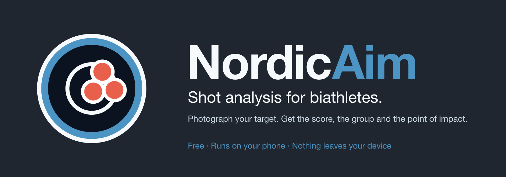
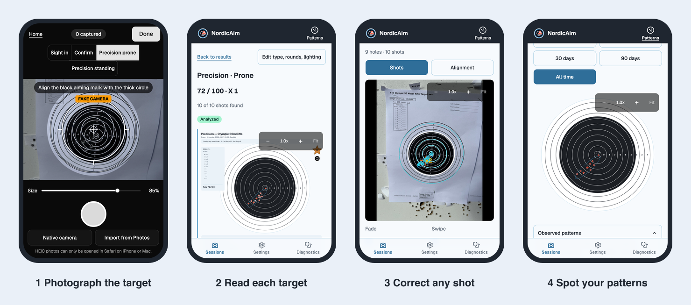

<p align="center">
  
</p>

<p align="center">
  <b>Photograph your target. Get the score, the group and the point of impact.</b><br>
  Free. Runs on your iPhone. Nothing leaves your phone.
</p>

<p align="center">
  <a href="https://komplexmojo.github.io/NordicAim/"><b>Open NordicAim</b></a>
  &nbsp;·&nbsp;
  <a href="#install-on-your-iphone">Install</a>
  &nbsp;·&nbsp;
  <a href="docs/guide/README.md">Read the guide</a>
  &nbsp;·&nbsp;
  <a href="https://github.com/KomplexMojo/NordicAim/issues">Send feedback</a>
</p>

<p align="center">
  
</p>

## What it does

NordicAim reads the paper target you just shot at 50 m and tells you what happened.

1. **Photograph the target.** Line up the live overlay with the black aiming mark, or import a photo you already took.
2. **Say what you shot.** Sighting or precision, prone, standing or both, how many rounds, lighting. It takes a few seconds.
3. **Read the analysis.** Your phone finds the holes, lays the target over your photo, scores it, measures the group and builds one summary image you can share.

You always have the last word. Every hole and the alignment can be corrected by hand, and the score updates.

## What you get

- **Scores you can check.** Precision targets score out of 100 with the X count and a ring tally. Sighting targets show hits and misses. When you shoot both positions, prone and standing are scored separately.
- **Group size and point of impact.** Extreme spread in millimetres and MOA, and the mean point of impact: how far, and which way, your group sits from centre. That is the number your sight adjustment starts from.
- **One summary image.** Sight in, confirm and the precision targets side by side, each drawn at the same scale so you can compare them by eye. Share it from the iPhone share sheet.
- **Your rule, your call.** Choose official gauge touch, centre in ring, or visible hole touch. Changing it re-scores every session you have stored, so old and new results stay comparable.
- **Patterns over time.** Every shot from every session, laid over the printed target for sight in, confirm, precision prone and precision standing. Filter to 30 days, 90 days or all time and see whether your misses have a habit.
- **A review pass.** Step through a session photo by photo, targets that need attention first.
- **Backup and restore.** One file holds all your sessions. Restore it on a new phone.

Two printed sheets are supported today: the **sighting sheet** and the **Olympic 50 m rifle target** used for precision work, shot with a .22 at 50 m.

## For athletes and teams

Each athlete installs NordicAim on their own phone in about ten seconds. There is no account to create and nothing to set up for the squad.

Results move between athletes and coaches as summary images. Every image states which scoring rule was used and how many shots were found, so a coach reading it knows exactly what the numbers mean. If the squad compares scores, agree on one scoring rule in Settings first.

There is no shared team account or dashboard. Each phone keeps its own history.

## Private, free, and light

- **Everything happens on your phone.** No server, no login, no analytics, no ads.
- **Your photos stay yours.** They are never uploaded. Only two things can leave the phone, and only when you ask: the summary image you share, and a backup file you create.
- **Free to use.** NordicAim is served as plain static files from GitHub Pages, so there is nothing to pay for and nothing to sign up to.
- **Works at the range.** After the first load it runs offline, so no signal is no problem.

## Install on your iPhone

1. Open **[komplexmojo.github.io/NordicAim](https://komplexmojo.github.io/NordicAim/)** in Safari.
2. Tap **Share**, then **Add to Home Screen**.
3. Open NordicAim from your Home Screen.

The first load downloads the image analysis engine, so do it on Wi-Fi before you head to the range. There is no App Store and no Apple account involved.

Your sessions live on the phone. Deleting the Home Screen app deletes them, so use **Settings, Back up now** every so often. NordicAim reminds you when it has been a while.

## Your first session

<table>
  <tr>
    <td align="center" width="33%"></td>
    <td align="center" width="33%"></td>
    <td align="center" width="33%"></td>
  </tr>
  <tr>
    <td valign="top"><b>1. Photograph the target.</b> Pick <i>Sighting</i> or <i>Precision</i> and a position. Use the <b>Size</b> slider until the overlay matches the sheet, and line up the black aiming mark with the thick circle. Tap the shutter, then <b>Use photo</b>. Already have a photo? Tap <b>Import from Photos</b>.</td>
    <td valign="top"><b>2. Add the details.</b> Name the session and say what you shot: template, prone, standing or both, rounds fired and lighting. Anything you leave out gets a sensible default.</td>
    <td valign="top"><b>3. Read the results.</b> Score, group size and point of impact appear with one summary image. Tap <b>Share</b> to send it, or <b>Update summary</b> after an edit.</td>
  </tr>
</table>

Something look off? Tap **Adjust shots** on the results screen to add, move or remove a hole, or nudge the alignment. The score updates as you go.

<p align="center">
  
  <br><sub>The summary image you share, made from the project's reference target photos.</sub>
</p>

Want the whole routine, from installing to comparing against your history? See the **[workflow, step by step](docs/guide/workflow.md)**.

New to it? The **[guide](docs/guide/README.md)** covers getting good photos, reading the results, corrections, patterns and backup in more detail.

## Status and feedback

NordicAim is an early release, built in the open with biathletes who shoot. If a score looks wrong, a screen is confusing, or you want something it does not do, [open an issue](https://github.com/KomplexMojo/NordicAim/issues). A photo of the target helps, but check it carries no location you would rather keep private.

<!-- Support: when there is a Patreon page or a project domain, add the link here in one place. -->

## Licence and support

**Using the app is free for everyone**, including clubs, teams and coaches. The [terms of use](TERMS.md) ask only that you
don't sell it or bundle it into something paid, don't host or copy it elsewhere, and leave the KomplexMojo credit on
summary images.

The source code is published so you can see how it works, under the [PolyForm Strict License 1.0.0](LICENSE.md): you may
read and run it for noncommercial use, but not modify or redistribute it, and code contributions are not accepted
([why](CONTRIBUTING.md)). It is source-available, not open source. The "NordicAim" name and logo are not licensed for
reuse. Third-party components keep their own licences ([NOTICE.md](NOTICE.md)).

NordicAim is built in response to what its users ask for. If it earns a place in your training, supporting its
development is the best way to shape what comes next.

Developed using NordicAim by **KomplexMojo**. Every summary image carries that credit.

<br>

<details>
<summary><b>For developers</b></summary>

### About the project

NordicAim is a Vite and React web app that runs entirely in the browser on the phone, with no backend. The analysis pipeline (OpenCV in a Web Worker), scoring and rendering are all client-side and covered by unit and end-to-end tests.

- Requires Node 22 and pnpm 10 (`corepack enable` picks up the pinned `packageManager` version).

```bash
pnpm install
pnpm dev          # http://127.0.0.1:3874
pnpm dev:test     # same, with VITE_FAKE_CAMERA=1 (used by Playwright)
pnpm build        # tsc -b && vite build
pnpm preview      # http://127.0.0.1:4173

pnpm check        # typecheck + lint + unit tests + privacy check (the gate for every milestone)
pnpm typecheck
pnpm lint
pnpm test         # Vitest unit tests
pnpm test:e2e     # Playwright, mobile Chromium + mobile WebKit
pnpm test:e2e:offline  # Playwright against the production build, offline after the first load
pnpm check:privacy
pnpm make:icons   # regenerate public/icons/* (sharp; concentric-ring motif)
```

Pushing to `main` deploys to GitHub Pages (`.github/workflows/pages.yml`). To run the capability checks on an iPhone, open
`https://komplexmojo.github.io/NordicAim/#/diagnostics` in Safari and again after **Add to Home Screen**,
since some checks (storage persistence, share) behave differently as a standalone app.

### Documentation map

| Doc | What it is |
|---|---|
| [`docs/guide/`](docs/guide/README.md) | The user guide |
| [`docs/brand/`](docs/brand/README.md) | Brand kit: logo, palette, voice, app icons |
| [`docs/DESIGN.md`](docs/DESIGN.md) | Original product design (verbatim) |
| [`docs/DESIGN-REVISIONS.md`](docs/DESIGN-REVISIONS.md) | Owner decisions that define the MVP and supersede parts of the design |
| [`docs/BACKLOG.md`](docs/BACKLOG.md) | Post-MVP items (not to be built without go-ahead) |
| [`docs/PLAN.md`](docs/PLAN.md) | Plan: verified facts, decisions, corrections, risks, open questions |
| [`docs/spec/`](docs/spec/) | Source-of-truth specs: analysis pipeline, geometry and scoring, data model and storage, capture overlay, metadata and lighting, diagrams and summary image, privacy, storage and hosting |
| [`docs/milestones/`](docs/milestones/README.md) | MVP milestones sized for lower-reasoning agents |
| [`AGENTS.md`](AGENTS.md) | Rules for any agent implementing a milestone |
| [`docs/reference/`](docs/reference/) | Reference target photos (metadata stripped) and the owner's example diagrams |
| [`fixtures/reference/`](fixtures/reference/) | Golden shot fixtures, GPS-free EXIF sidecars and sample, seed calibrations, HEIC test image |

### Out of scope

Apple Health, Strava and multi-user accounts.

### Privacy of this repository

There is no server: all data stays on the phone. This repository is public and contains code only. The original target
photos contain GPS and live only in the gitignored `fixtures/private/`. `pnpm check:privacy` fails if any tracked image
carries GPS EXIF.

</details>
