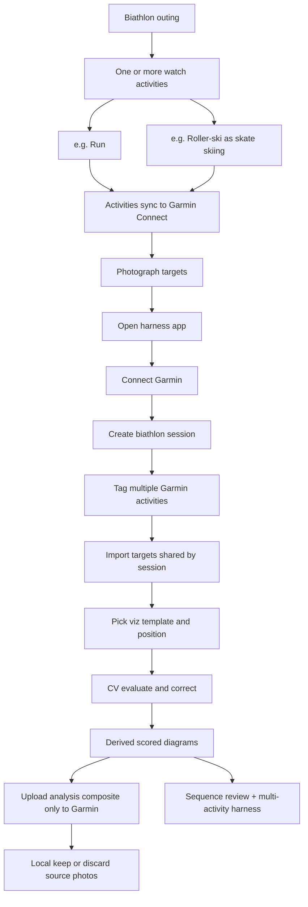
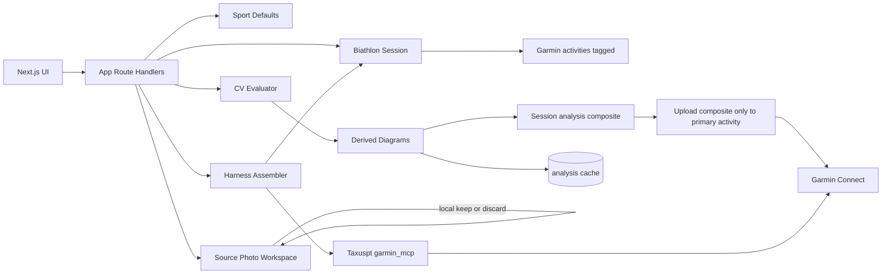

# Biathlete Training Harness

> **Repository note (added, not part of the original design):** this file is the product owner's design, kept verbatim.
> Where the plan corrects or refines it, see [`PLAN.md`](PLAN.md) §3–§5. Reference images:
> sighting `IMG_5057` → [`reference/IMG_5057-sighting.jpg`](reference/IMG_5057-sighting.jpg),
> precision `IMG_5132` → [`reference/IMG_5132-precision.jpg`](reference/IMG_5132-precision.jpg),
> example derived diagrams → [`reference/example-diagram-sighting.png`](reference/example-diagram-sighting.png),
> [`reference/example-diagram-precision.png`](reference/example-diagram-precision.png).

## Goal

Ship a usable first slice for **biathlon shooting at 50m** with **two visualization templates**—**sighting** (`IMG_5057`) and **precision** (`IMG_5132`, Olympic 50m scoring: Inner=10, 1st=10, 2nd=9, Total/100)—each usable **prone**, **standing**, or **both**. A **biathlon session** tags **multiple Garmin activities** that share targets. The **only image published to Garmin** (and later to Strava) is the **completed shooting-analysis composite** (≤2 sighting + ≤2 precision + analysis)—never source photos. Garmin Connect ([Taxuspt/garmin_mcp](https://github.com/Taxuspt/garmin_mcp)) is the activity database. Strava publish is deferred but will follow the same single-image rule.

## Basic workflow



1. Athlete records **one or more watch activities** during the outing (e.g. run, then roller-ski / skate skiing). Each syncs to Garmin Connect separately.
2. After shooting they **photograph the paper targets**.
3. In the app they authenticate to Garmin, create a **biathlon session**, and **tag all related Garmin activities** into it.
4. Target photos belong to the **biathlon session** (shared across tagged activities)—not to a single exercise alone.
5. They choose **visualization template** × **position**, set rounds, run **CV evaluation**.
6. App produces **derived diagrams** for the session’s targets.
7. Publish uploads **only the completed shooting-analysis composite** to the session’s **primary** Garmin activity (never source photos or per-target working diagrams).
8. Source photos stay in the app workspace only — user may **keep** or **discard** them locally after publish.

Strava publish is **out of scope for implementation in this phase**, but when added later it will receive the **same single completed analysis image only** (no source photos).

## Biathlon session (multi-activity)

A biathlon outing often spans **several Garmin exercises**. Model that explicitly:

| Concept | Role |
|---|---|
| **Biathlon session** | App container for one outing’s shooting + linked exercises |
| **Garmin activities[]** | One or more Connect activities tagged into the session (run, skate skiing / roller-ski, classic ski, etc.) |
| **Primary activity** | Which tagged activity receives the **completed shooting-analysis composite** (Activity Photo) |
| **Targets / diagrams** | Owned by the biathlon session; shared by all tagged activities |

UX:

- Multi-select recent Garmin activities (filter by date; show type labels, including skate skiing for roller-ski).
- **Align using photo EXIF date/time:** on import, read `DateTimeOriginal` (+ timezone offset) from each target photo and suggest Garmin activities whose start/end window overlaps or falls on the same local day (and near the capture time). GPS from EXIF can further rank nearby activities when present.
- Suggest grouping activities that are close in time on the same day as the photo timestamps.
- Harness view **aggregates** load/HR/duration across tagged activities beside shared shooting metrics.
- Add/remove activities from a session later without re-importing targets; re-run alignment suggestions if new photos are added.

## Stack

- **Next.js + TypeScript + Tailwind + shadcn/ui**
- **Garmin = activity/training database**; the **only** image written to Garmin is the completed shooting-analysis composite
- **Source photos = local workspace only** (never uploaded to Garmin/Strava)
- **Sport defaults** (biathlon 50m; **precision** + **sighting** target templates)
- **HEIC/JPEG/PNG ingest**
- Taxuspt `garmin_mcp` + per-session credential prompt; explicit demo mode

## Architecture



## Sport defaults

**Primary profile: Biathlon 50m**

- Distance: **50 m**
- Positions: **prone**, **standing**
- Competition bout default: **5 rounds** per position
- Precision / single-shot test default: **10 shots**
- Sighting / zeroing default: **10 shots** (often dense overlaps)
- Warm-up `both`: user-specified rounds per position
- Caliber hint: **.22 LR**
- Two built-in **target templates** (see below)

Extensible later to other shooting-sport default profiles.

## Visualization templates (independent of position)

The app has **two visualization / scoring templates**. Template and shooting position are **orthogonal**:

| Axis | Values | Meaning |
|---|---|---|
| **Visualization template** | `sighting` \| `precision` | Which diagram art + scoring rules to use |
| **Position** | `prone` \| `standing` \| `both` | How the athlete shot that paper |

Either template can be shot **prone**, **standing**, or **both** on the same target.

### Template A — Sighting / zeroing (`IMG_5057`)

**Biathlon sighting-in sheet** — Caledonia Nordic Ski Club – Biathlon.

Printed geometry:

- Official sizes: **45 mm prone**, **115 mm standing**
- Solid discs: **115 mm** (large dark) and **45 mm** (inner solid white ring)
- Dotted guides: **110 mm**, **40 mm**

Derived diagram: dark disc + zone rings (not ISSF 1–10).

**How position applies on this template:**

- `prone` → evaluate hits vs **45 mm** (and 40 mm guide); MPI/group for zeroing prone
- `standing` → evaluate hits vs **115 mm** (and 110 mm guide); MPI/group for zeroing standing
- `both` → furthest-from-center rule splits shots; prone subset scored on 45 mm, standing subset on 115 mm

Outputs: zone hit/miss, MPI, group MOA/MRAD, multiplicity for dense overlaps (sample has ~10 shots in a ragged cluster).

### Template B — Precision (`IMG_5132` / Olympic 50m sheet)

**Olympic 50 Meter Rifle Target** — Caledonia Nordic Ski Club – Biathlon.

Printed scoring (from sheet — use this as the precision score standard):

- Header: “Single shot Test - 10 shots”; Prone / Standing checkboxes; RESULTS tally 0–10; **Total = ___ / 100**
- Scoring key on sheet: **Inner Circle = 10**, **1st Ring = 10**, **2nd Ring = 9**
- Rings continue outward 8…1; miss outside 1-ring = 0
- Inward gauging / touch rule (highest ring touched)

Derived diagram: numbered Olympic rings + shot markers + RESULTS-style tally.

**Reference read on sample precision photo (declared 10):** ~9–10 visible holes lower-left/center; one irregular hole may be a double; approximate ring mix on the sample is on the order of two 10s, one 9, then 8s/7s/6s/5 — app must compute from calibrated CV + user multiplicity, not hard-code that tally.

**How position applies on this template:**

- `prone` / `standing` → all shots tagged that position; full ISSF series score for that position
- `both` → furthest-from-center rule; ISSF scores + MOA/MRAD split by position subset

Outputs: ring scores, RESULTS tally `/100`, groups, MOA/MRAD.

### Selection UX

Per photo the user sets (independent fields):

| Field | Values |
|---|---|
| Visualization template | `sighting` (`IMG_5057`) \| `precision` (`IMG_5132`) |
| Position | `prone` \| `standing` \| `both` |
| Rounds (prone) | when position is `prone` or `both` |
| Rounds (standing) | when position is `standing` or `both` |

- Never lock position to a template (e.g. sighting is not “prone-only”).
- Renderer always draws the selected template; position only affects shot labels, which sighting zone is primary, and split metrics.

### Mixed-target standing rule

When `both`: after CV + corrections, assign the **S furthest-from-center** shots (S = standing rounds) to standing; remainder prone; multiplicity expands before ranking; user can override; metrics split by position.

## Photo metadata (EXIF + inferred lighting)

Pull and store metadata from each imported target photo. Sample HEICs (`IMG_5132`, `IMG_5057`) from iPhone 16 Pro Max already include usable fields.

### Directly available from EXIF (on your samples)

| Field | Example use |
|---|---|
| `DateTimeOriginal` + `OffsetTimeOriginal` | **Primary key for activity alignment** — local capture time (e.g. 2026-09-05 16:56 −07:00) matched to Garmin activity windows |
| GPS lat/lon/alt | Secondary alignment / range location (Prince George area on samples) |
| `GPSImgDirection` | Camera heading |
| Make / Model / Lens | Device context |
| `BrightnessValue` | Scene brightness (APEX) — strong daylight cue |
| `ISOSpeedRatings`, `ExposureTime`, `FNumber` | Exposure triad for lighting inference |
| `Flash` | Whether flash fired (both samples: no flash) |
| `WhiteBalance` | Auto vs manual (samples: auto) |

### Activity alignment from photo timestamps

1. On import, extract EXIF capture time (with offset) per photo.
2. Query Garmin activities around that local day / time window via MCP.
3. Auto-suggest activities that overlap the photo time (targets are usually photographed shortly after the watch session ends — prefer activities ending near capture time, same calendar day).
4. When multiple photos span a range, use the **min–max capture window** to suggest the set of activities for the biathlon session.
5. User confirms/edits the tagged set; if EXIF is missing, fall back to manual date pick + activity list.

Not reliably present as a dedicated “day / night / artificial” tag on iPhone HEIC — that label is **derived** (and user-correctable).

### Inferred lighting classification

Derive a lighting label for each photo:

| Label | Typical signals |
|---|---|
| `daylight` | High `BrightnessValue`, low ISO, short exposure, local clock daytime, cool/neutral white balance heuristic |
| `night` | Low brightness, high ISO and/or long exposure, local clock night, no/low ambient |
| `artificial` | Indoor/range lights: moderate brightness with warm color cast and/or flash; or user-marked when EXIF is ambiguous (dusk under floodlights, etc.) |
| `mixed` / `unknown` | Conflicting cues — show suggestion + ask user |

Pipeline:

1. Read EXIF on import (HEIC/JPEG/PNG).
2. Compute `lightingSuggestion` from brightness + exposure + local hour (+ simple image color-temperature heuristic).
3. Show suggestion in categorize UI; user can confirm or override (`daylight` \| `night` \| `artificial` \| `mixed`).
4. Persist on the analysis record and include on the derived diagram caption / Garmin upload notes.
5. If EXIF stripped (re-encoded share), fall back to image heuristics + mandatory user pick.

Also retain: capture timestamp (required for activity alignment), GPS (if present), device model.

| Artifact | Store |
|---|---|
| Field exercise recording | **Watch → Garmin Connect** (one or more activities per outing) |
| Biathlon session + activity links | App (session tags multiple Garmin activity IDs; owns shared targets) |
| Source target photos | **App only** — never uploaded to Garmin or Strava; keep or discard locally after publish |
| Per-target working diagrams | **App only** (review / sequence player) |
| **Completed shooting analysis** (composite ≤2 sighting + ≤2 precision + analysis) | **Only image uploaded to Garmin** (primary activity Activity Photo). Future Strava publish uses this same image only. |
| Activity metrics / health | **Garmin via MCP** (aggregated across tagged activities in harness) |
| CV analysis JSON | Local analysis cache (regenerable) |
| Garmin credentials | Entered each session; optional OS secure vault |

MCP lacks Activity Photo tools today → `GarminDiagramStore` uploads/lists diagrams via Connect image endpoints using the same per-session credentials as MCP.

## Computer vision evaluation and review

1. Detect target **template** (precision vs sighting) from category + optional auto-hint; user can override.
2. Crop paper sheet (ignore backer / board).
3. Calibrate geometry:
   - **Precision:** ISSF 50m ring diameters (user nudge).
   - **Sighting:** map 40/45/110/115 mm rings from the printed dark disc (user nudge).
4. Detect holes; support **dense overlapping clusters** (sighting sample is the hard case).
5. Apply multiplicity + position rules (`both` → furthest-from-center = standing).
6. Render **derived diagram** for the active template (numbered rings vs zone discs; shots; groups; MOA/MRAD; position colors).
7. Interactive correction: re-assign ring/zone, multiplicity, drag/add/remove, override position when `both`.
8. Compute **score / outcome range** when declared rounds exceed confidently identified shot units (see below).
9. Sequence player over diagrams for the outing.
10. On confirm: build the **completed shooting-analysis composite** and upload **that image only** to the session’s primary Garmin activity; prompt local keep/discard for source photos (sources never leave the app to Garmin/Strava).

### Reference reads

**Precision `IMG_5132` (declared 10):** ~9 distinct holes; one irregular hole likely a double; ISSF ring scoring + missing-shot modes.

**Sighting `IMG_5057` (declared 10):** large dark 115 mm disc with 45 mm inner zone; shots clustered upper-right of center in a **ragged multi-overlap**; only ~6–8 silhouettes visible — user must assign multiplicities inside the cluster; primary outputs are zone hit/miss, MPI, group MOA/MRAD (not `/100` ring total).

### Missing / uncounted shot modes

When `declaredRounds > sum(multiplicities of placed shots)` (or N rounds marked unresolved), compute three outcomes and show a **range**:

| Mode | Precision (ring score) | Sighting (zone / group) |
|---|---|---|
| **Optimistic** | Each missing round = **highest** identified ring | Each missing round treated as matching the **best** existing outcome (e.g. inside the tightest/highest-value zone already hit; pulls MPI/group toward the best cluster) |
| **Pessimistic** | Each missing round = **lowest** identified ring (or 0 if none) | Each missing round treated as the **worst** identified outcome (outermost / miss relative to selected zone) |
| **Averaged** | Each missing round = **mean** identified ring (multiplicity-weighted) | Each missing round placed at the **mean radial error** of identified shots (or average of zone outcomes) for MPI/group math |

UI:

- Show identified-only summary plus **Pessimistic–Optimistic** range with Averaged called out.
- Raising multiplicity on an overlap cluster (critical on sighting targets) narrows the range.
- Same three modes apply per **position subset** when `both`.
- Diagram + Garmin caption include the range (or a user-pinned mode).

## Sample diagram artifacts

Produce (via a separate agent pass) clean derived sample diagrams from the user’s reference photos for design/CV validation:

| Sample | Source photo | Output |
|---|---|---|
| Sighting | `IMG_5057` | Session-style derived sighting diagram (45/115 mm zones, MPI, group) |
| Precision | `IMG_5132` | Session-style derived precision diagram (Olympic rings, RESULTS `/100`) |

These illustrate the per-slot diagrams that feed the **completed shooting-analysis composite** (the only image published to Garmin / later Strava).

The **publish artifact** for a biathlon session is **one representative image** (plus structured analysis text/JSON), not a pile of separate uploads.

### Composite layout

One image containing:

1. **Up to four target diagrams** arranged as a grid:
   - **2× Sighting** slots
   - **2× Precision** slots
2. An **analysis section** on the same artifact (caption band / side panel / footer) with session-level details: linked Garmin activities, lighting, per-diagram scores/MPI/MOA/MRAD, optimistic–pessimistic ranges, position splits.

```text
+------------------+------------------+
| Sighting 1       | Sighting 2       |
+------------------+------------------+
| Precision 1      | Precision 2      |
+------------------+------------------+
| Analysis: scores, MPI, MOA/MRAD,    |
| lighting, activities, notes         |
+-------------------------------------+
```

### Slot rules

| Case | Behavior |
|---|---|
| 2 sighting + 2 precision selected | Full 2×2 grid + analysis |
| Only **1 precision** (common) | Show one precision cell; leave the other precision slot empty or collapsed — do **not** require a second precision |
| 0–1 sighting | Same: empty/collapse unused sighting slots |
| Only sighting or only precision that day | Composite still valid with fewer than 4 diagrams |

### Choosing which photos fill the slots

- Session may import **more than 4** target photos.
- User **selects** which photos feed the shooting analysis / composite:
  - Up to **2 sighting** templates
  - Up to **2 precision** templates
- Non-selected photos remain in the session library for review/sequence play but are **excluded** from the published composite unless later swapped in.
- Default suggestion: most recent per template, or best score / tightest group — user confirms.

### Upload (Garmin / future Strava)

- **Only** the completed shooting-analysis composite is published externally.
- Upload that **one** image to the session’s **primary** Garmin activity as the Activity Photo.
- Do **not** upload source target photos or per-target working diagrams to Garmin.
- **Future Strava:** when social publish is added, it will attach the **same completed analysis image only** — still no source photos.
- Source photos and per-target diagrams remain local (sequence player / library); user may keep or discard sources after publish.

## Garmin credentials (required UX)

- **Prompt every session** before Garmin connect (email/password + MFA if needed).
- Optional **Remember securely** in OS vault only — still confirm/unlock every session.
- In-memory session only; clear on logout/close/idle.
- No silent long-lived token UX; explicit **Demo mode** when skipping Garmin.

## UI surfaces

- **Connect Garmin** — per-session prompt
- **Biathlon session** — multi-select Garmin activities; **EXIF date/time from photos suggests matching activities**; set primary; shared targets
- **Import & categorize** — template × position + rounds; show photo capture time used for alignment; lighting suggestion with override
- **CV review** — per-target diagram correction (RESULTS for precision using sheet scoring: Inner=10, 1st=10, 2nd=9, …)
- **Composite picker** — choose up to 2 sighting + up to 2 precision (allow only 1 precision); analysis panel
- **Publish** — upload **only** the completed shooting-analysis composite to primary Garmin activity; sources stay local (keep/discard)
- **Sequence player** + **Harness** (multi-activity load vs shared shooting metrics)
- Visual: winter range ice-blue/charcoal; expressive type; full-bleed landing

## Out of scope for this first slice

- Strava / social publish **implementation** (later phase; when added, **same rule**: only the completed analysis image — no source photos)
- Multi-sport library beyond defaults schema + biathlon profile
- Separate user accounts from Garmin
- Deep-learning hole detector
- Native mobile

## Delivery checklist

- Scaffold Next.js; README documenting multi-activity session → shared targets → **one analysis composite** → Garmin (sources never uploaded)
- Precision scoring from Olympic 50m sheet (Inner Circle=10, 1st Ring=10, 2nd Ring=9, Total/100)
- Composite: ≤2 sighting + ≤2 precision + analysis; allow 1 precision only; user picks slots when >4 photos
- Dual-template CV → categorize → publish **analysis composite only** to primary activity → local keep/discard sources
- Fixtures: `IMG_5132` (precision) and `IMG_5057` (sighting)
- Sequence player + harness aggregating multi-activity load with shooting metrics
- Dev server on uncommon port; commit/push on current branch (no PR unless asked)
