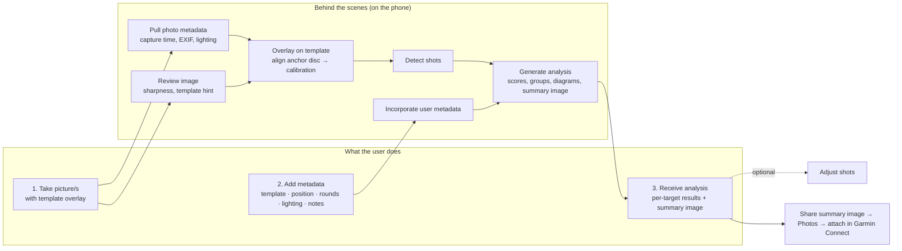
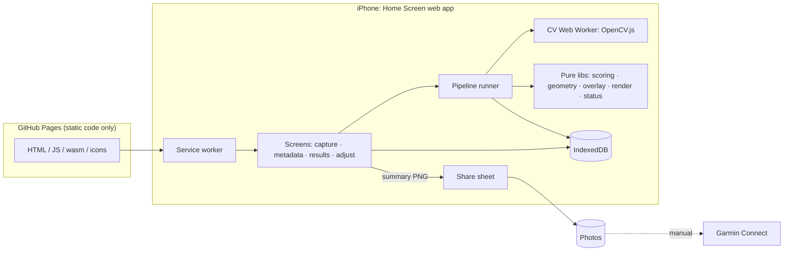

# Plan: Biathlete Training Harness (advanced-shooting-analysis)

Revision 4 (MVP), 2026-09-14. Inputs:
- [`DESIGN.md`](DESIGN.md) (verbatim)
- [`DESIGN-REVISIONS.md`](DESIGN-REVISIONS.md) (MVP scope: 3-step UX, automatic pipeline, on-phone, no Apple Health)
- [`BACKLOG.md`](BACKLOG.md)
- the reference photos and the owner's example diagrams.

| Layer | File(s) | Audience |
|---|---|---|
| Intent | `DESIGN.md`, `DESIGN-REVISIONS.md`, `BACKLOG.md` | Product owner |
| Decisions & reasoning | `PLAN.md` (this file) | Owner, high-tier reviewers |
| Source of truth | `spec/*.md` | Every implementing agent |
| Work units | `milestones/MNN-*.md` + [index](milestones/README.md) | Implementing agents |
| Agent rules | [`/AGENTS.md`](../AGENTS.md) | Every implementing agent |

---

## 1. MVP in one picture

Stage A (image review, alignment, metadata, shot detection) starts **as soon as a photo is taken**, while the user adds
metadata. Stage B (scoring, diagrams, summary image) runs when the user taps **Analyze**. See
[`spec/analysis-pipeline.md`](spec/analysis-pipeline.md).

## 2. Verified facts

| # | Fact (probed 2026-09-13/14) | Consequence |
|---|---|---|
| F1 | Samples are iPhone 16 Pro Max HEIC. `IMG_5057` 2026-08-24 19:30:09 `-07:00`, BV 5.57. `IMG_5132` 2026-09-05 16:56:03 `-07:00`, BV 9.71. `Flash`=16 (not fired), WB auto, GPS present. | GPS-free sidecars; `exif-sample.jpg` mirrors IMG_5132 without GPS |
| F2 | `exifr` fails on these original HEICs but reads JPEG EXIF correctly with `reviveValues: false` (verified on `exif-sample.jpg`: raw dates, `ISO` key, exact rationals). | Photo metadata from EXIF is best-effort; in-app captures use the phone clock |
| F3 | `sharp` can't decode HEIC pixels; `sips` keeps GPS; `sharp` re-encodes strip metadata (need `.rotate()`). | `sharp` is dev-only (tests, scripts, privacy check) |
| F4 | `@techstark/opencv-js` and `@resvg/resvg-js` work in Node 22. | CV and render code unit-tested in Node; the phone runs OpenCV in a Web Worker |
| F5 | Precision sheet = ISSF 50 m rifle geometry; the sighting sheet has an unlabelled ~15 mm inner circle. | geometry-scoring §1 |
| F6 | The owner's example diagrams are internally consistent; traced shots reproduce 72/100, 41.9 mm/2.88 MOA, 27.7 mm/1.90 MOA, 9 hit/1 miss. | Golden fixtures |
| F7 | Garmin lets users add activity photos only in the Connect mobile app; there is no usable API. | Manual attach |
| F8 | WebKit storage: Home Screen web apps aren't subject to Safari's 7-day eviction; `navigator.storage.persist()` exists; deleting the Home Screen app deletes its data. | Request persistence; backups in backlog (B1, flagged risk) |
| F9 | iOS web apps can use camera, Web Share with files, service workers, IndexedDB, Web Workers + WebAssembly, OffscreenCanvas, Screen Wake Lock, and Safari HEIC decoding. | MVP feature set |

## 3. Decisions

| ID | Decision | Why |
|---|---|---|
| D1 | **Vite + React + TypeScript SPA**, hash routing, Tailwind, shadcn/ui, zod. shadcn uses its current `radix-nova` preset; its self-hosted dependencies are **approved** (owner, 2026-09-15): `radix-ui`, `lucide-react`, `class-variance-authority`, `tw-animate-css`, `next-themes`, `@fontsource-variable/geist` (UI text only; SVG diagrams keep the system font stack) | No backend; works on static hosting |
| D2 | pnpm 10, Node 22 tooling; Vitest (Node + `fake-indexeddb`); Playwright (mobile Chromium + mobile WebKit) | Testable without a phone |
| D3 | **IndexedDB via `idb`**: `sessions`, `photos`, `analyses`, `blobs` (ArrayBuffer), `settings` | Works in Safari and in tests |
| D4 | **Pure/adapter split**: pixel algorithms take `RgbaImage`; browser adapters only convert | Same code in Node tests and on the phone |
| D5 | **Automatic two-stage pipeline** (`spec/analysis-pipeline.md`), sequential job runner, CV in a Web Worker via Comlink | REV-16; keeps the UI responsive |
| D6 | **Alignment uses the overlay as a prior**: CV refines it; if CV fails, fall back to the overlay alignment with a warning | REV-5/REV-16; robust even when CV struggles |
| D7 | **Status = analyzed / needs attention** with plain-language reasons; ranges for unaccounted rounds | REV-18 |
| D8 | **Optional Adjust shots** screen (calibration handles, add/move/delete shots, multiplicity) | Overlapping holes can't always be detected |
| D9 | **One SVG renderer** for diagrams and the summary image; system font stack; canvas rasterisation on the phone | One visual truth; SF Pro on iPhone |
| D10 | **Summary image auto-built** after analysis (most recent 2 sighting + 2 precision analyzed targets); Web Share with a download fallback; Garmin attach card | Requirement 3; picker in backlog |
| D11 | **PWA basics**: manifest + service worker precache for Add to Home Screen and offline use | Works at the range without signal |
| D12 | **GitHub Pages** hosting via Actions; strict same-origin CSP | Free, no server |
| D13 | **Diagnostics page first** (M01) to verify iPhone capabilities | Surfaces iOS risks early |
| D14 | **Fixture privacy**: originals in gitignored `fixtures/private/`; `pnpm check:privacy` in CI | Public repo |

## 4. Corrections and clarifications to the design

| ID | Topic | Resolution |
|---|---|---|
| C1 | Automatic upload to Garmin | Not possible; manual attach |
| C2 | Garmin activities, Apple Health | Removed (REV-17) |
| C3 | "Inner Circle = 10, 1st Ring = 10, 2nd Ring = 9" | ISSF 50 m rifle: inner ten Ø 5.0 (X), 10-ring Ø 10.4, 9-ring Ø 26.4 |
| C4 | "Optimistic edge-credit" wording | Touch rule always applies; modes are only for unaccounted rounds |
| C5 | Sighting dotted 40/110 mm guides | hit = hole touches solid circle; clean = centre inside guide (Q2) |
| C6 | "45 mm inner solid white ring" | Ring line on paper; stylised as a white disc like the example |
| C7 | "Position agnostic" example | Every diagram shows its position |
| C8 | `both` + missing rounds | Standing takes the S furthest identified units; missing rounds fall to prone |
| C9 | Sighting averaged = "mean radial error" | Missing units at identified MPI; expected hits = hit rate × missing |
| C10 | "N rounds marked unresolved" | missing = declared − identified → shown as a range, reason `rounds-unaccounted` |
| C11 | Lighting from EXIF | In-app captures have no EXIF, so lighting uses capture hour + colour cast; the user confirms on the metadata screen |

## 5. MVP features beyond the literal design text

| ID | Feature | Milestone |
|---|---|---|
| E1 | Live template overlay (size slider, dim mask, alignment hint, wake lock) | M06, M07 |
| E2 | Overlay prior + CV alignment with fallback | M10 |
| E3 | Image review: sharpness warning and template-mismatch warning | M10 |
| E4 | Quick start straight into the camera (REV-8) | M09 |
| E5 | Plain-language "needs attention" reasons | M12 |
| E6 | X-count, 2σ group ellipse, mean radius, MPI offset | M03, M05 |
| E7 | `full` and `cell` diagram variants | M05 |
| E8 | Summary image share plus a Garmin Connect attach card | M14 |
| E9 | Diagnostics page | M01 |
| E10 | Dev/test-only fake camera and test hooks | M07, M12 |
| E11 | CV evaluation script with synthetic data, reference photos, and owner ground truth | M10, M11 |

## 6. Risks

| ID | Risk | L / I | Mitigation |
|---|---|---|---|
| R1 | CV misses or merges holes (dense overlaps) | H / M | Range for unaccounted rounds, needs-attention reasons, optional Adjust shots |
| R2 | CV alignment fails (glare, angle, partial target) | M / M | Overlay prior fallback + warning; Adjust calibration |
| R3 | iOS Safari quirks (camera, SVG→canvas, OpenCV under CSP, share) | M / M | M01 diagnostics on device; device checklists |
| R4 | **Data loss without backups** (app deleted) | M / M | Persistence request; summary images saved to Photos survive; backups first in backlog (B1) |
| R5 | Phone memory during CV | L / M | ≤ 3000 px working, ≤ 1200 px detection, sequential jobs, Mats deleted |
| R6 | First load size (~10 MB OpenCV) | M / L | Service worker precache; CV loads lazily |
| R7 | Low-tier agents drift from spec or build backlog items | M / H | Numeric vectors, exact names, stop-and-ask, BACKLOG marked off-limits |
| R8 | GPS leakage via the public repo | M / M | D14 |

## 7. Architecture

## 8. Milestones

Index with status: [`milestones/README.md`](milestones/README.md). **15 milestones, all MVP.**

| MVP step | Milestones |
|---|---|
| Take picture(s) | M06 overlay geometry, M07 capture screen, M04 storage |
| Add metadata | M09 metadata screen + quick start |
| Review image / overlay on template | M10 target alignment |
| Pull photo metadata | M08 metadata & lighting |
| Incorporate user metadata / generate analysis | M03 scoring, M11 shot detection, M12 analysis & results, M05 diagrams |
| Receive analysis (summary image) | M14 summary image & share |
| Optional correction | M13 adjust shots |
| Foundation / release | M01 scaffold + diagnostics, M02 domain model, M15 install & release |

## 9. Open questions for the owner

| ID | Question | Default if unanswered |
|---|---|---|
| Q1 | Keep original HEICs out of this public repo? | Keep them out |
| Q2 | Sighting: hole touching 45/115 mm = hit; dotted 40/110 mm = clean? | Yes (C5) |
| Q3 | Hole diameter 5.6 mm (.22 LR)? | 5.6 mm |
| Q4 | Summary image slot choice when more than 4 targets: most recent 2 + 2? | Yes (picker in backlog) |
| Q5 | OK that backups are post-MVP (risk R4)? | Yes, first backlog item |

## 10. Definition of done (MVP)

- `pnpm check`, `pnpm build`, `pnpm test:e2e` green in CI; GitHub Pages deploys from `main`.
- On the owner's iPhone (Home Screen app):
  1. **Start & capture** → photograph a precision and a sighting target with the overlay
  2. **Add metadata** → **Analyze**
  3. receive per-target results (hits/rings, group size, MPI, ranges) and the summary image
  4. Share → Save Image → attach in Garmin Connect
  5. works in airplane mode.
- Golden fixtures show precision **72/100** and sighting **9 hit / 1 miss** in results and the summary image.
