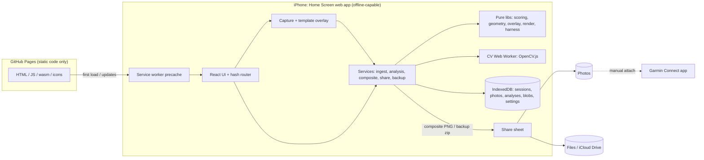

# Plan: Biathlete Training Harness (advanced-shooting-analysis)

Revision 3, 2026-09-14. Inputs: [`DESIGN.md`](DESIGN.md) (verbatim), [`DESIGN-REVISIONS.md`](DESIGN-REVISIONS.md)
(current platform: on-phone web app now, Capacitor later), the reference photos, the owner's example
diagrams, and hands-on probing of libraries and platform constraints.

| Layer | File(s) | Audience |
|---|---|---|
| Intent | `DESIGN.md`, `DESIGN-REVISIONS.md` | Product owner |
| Decisions & reasoning | `PLAN.md` (this file) | Owner, high-tier reviewers |
| Source of truth | `spec/*.md` | Every implementing agent |
| Work units | `milestones/MNN-*.md` + [index](milestones/README.md) | Implementing agents |
| Agent rules | [`/AGENTS.md`](../AGENTS.md) | Every implementing agent |

---

## 1. Product summary

**Phase 1: an installable web app that runs entirely on the iPhone.**

1. After the outing, tap **Start & capture** (creates or reuses today's session).
2. For each paper target, pick **Sighting** or **Precision** and **prone / standing / both**. The camera shows
   that template's **overlay**; line up the printed rings and capture.
3. On the phone, the overlay gives the initial calibration, CV proposes shots, and the owner corrects them.
   Targets become **reviewed automatically** once the shot count matches the declared rounds.
4. The app scores each target: ISSF rings /100 or sighting hit/miss, MPI, extreme spread, MOA/MRAD, the
   `both` split, and a pessimistic–optimistic range when rounds are unaccounted for.
5. The owner builds **one composite image** (≤2 sighting + ≤2 precision + analysis), shares or saves it, and
   attaches it in Garmin Connect.
6. Sources are kept or discarded on the phone. The sequence player and harness show trends. **Backups** export
   to Files or iCloud Drive.

**Phase 2: Capacitor.** The same app, installed natively via Xcode, adds Apple Health workouts (duration, HR,
distance, energy beside shooting metrics; workout suggestions from capture times) and saves directly to Photos.

## 2. Verified facts

| # | Fact (probed 2026-09-13/14) | Consequence |
|---|---|---|
| F1 | Samples are iPhone 16 Pro Max HEIC. `IMG_5057` 3024×4032, 2026-08-24 19:30:09 `-07:00`, BV 5.57, ISO 64. `IMG_5132` 4284×5712, 2026-09-05 16:56:03 `-07:00`, BV 9.71, ISO 80. `Flash`=16 (not fired), WB auto, GPS present. | GPS-free sidecars in `fixtures/reference/*.exif.json` |
| F2 | `exifr` fails (`Unknown file format`) on these original HEICs in Node. | EXIF from HEIC is best-effort; in-app captures don't need EXIF. JPEG EXIF via `exifr` is spec'd and tested with a GPS-free fixture. |
| F3 | Prebuilt `sharp` can't decode HEIC pixels. `sips` keeps GPS on conversion. `sharp` re-encodes strip metadata but need `.rotate()` first. | `sharp` is dev-only (tests, scripts, privacy check). The phone decodes images natively. |
| F4 | `@techstark/opencv-js` (loads in Node in ~30 ms) and `@resvg/resvg-js` work in Node 22. | Pure CV and render code is unit-tested in Node; the phone runs the same code (OpenCV in a Web Worker). |
| F5 | Precision sheet = ISSF 50 m rifle geometry. The sighting sheet has an unlabelled ~15 mm inner circle. | spec/geometry-scoring.md §1 |
| F6 | The owner's example diagrams are internally consistent (72/100; 27.7 mm = 1.90 MOA = 0.55 MRAD; 41.9 mm = 2.88 MOA = 0.84 MRAD). Traced shots reproduce them exactly. | Golden fixtures `sample-shots-*.json` |
| F7 | Garmin lets users add activity photos **only in the Connect mobile app**. The official developer program is business-only. The unofficial login needs a server and broke in March 2026. | Manual attach (REV-4); no Garmin connection (REV-12) |
| F8 | **WebKit storage policy**: Home Screen web apps have their own usage counter and aren't subject to Safari's 7-day eviction. Since iOS 17, quotas are based on disk size and are generous. `navigator.storage.persist()` exists. Deleting the Home Screen app deletes its data. | Request persistence; backups are core (REV-14) |
| F9 | Web apps on iOS can use: camera (`getUserMedia`), Web Share with files, service workers/offline, IndexedDB, Web Workers + WebAssembly, OffscreenCanvas, Screen Wake Lock, DeviceOrientation (with permission), and native HEIC decoding in Safari. They **cannot** use Vision, Core ML, HealthKit, or PhotoKit. | Phase 1 feature set; Phase 2 for HealthKit/Photos |
| F10 | **Capacitor** is mainstream: `@capacitor/core` ~15.9M npm downloads/month (Aug–Sep 2026), v8.5.2 released 2026-09-11, maintained by Ionic/OutSystems. React Native (49.3M) and Expo (32.0M) are larger, but Capacitor is the standard web-to-native wrapper. | REV-13 |
| F11 | Apps can be installed on your own iPhone via Xcode without App Review. A free account's installs expire after 7 days; the paid program ($99/yr) avoids that. CloudKit JS needs the paid membership. | Phase 2 prerequisites |
| F12 | This Mac has only Command Line Tools (no full Xcode). | Phase 2 needs an Xcode install |

## 3. Decisions

| ID | Decision | Why |
|---|---|---|
| D1 | **Vite + React + TypeScript SPA** with React Router **hash routing**, Tailwind, shadcn/ui, zod. | No backend needed. Hash routes work on static hosting and inside Capacitor. Simplest stack for lower-tier agents. |
| D2 | pnpm 10, Node 22 for tooling. Vitest (Node, with `fake-indexeddb`), Playwright (mobile Chromium + mobile WebKit projects). | Reproducible and testable without a phone |
| D3 | **Storage: IndexedDB via `idb`**, with stores `sessions`, `photos`, `analyses`, `blobs` (bytes as `ArrayBuffer`), `settings`. | Universally supported (Safari, Capacitor WKWebView, fake-indexeddb in tests) |
| D4 | **Pure/adapter split**: every pixel algorithm takes an `RgbaImage { data, width, height }`. Browser adapters only convert Blob ↔ canvas ↔ `RgbaImage`. | Algorithms run identically in Vitest (Node) and on the phone |
| D5 | **CV in a Web Worker** (OpenCV.js via `@techstark/opencv-js`, RPC via Comlink). | Keeps the UI responsive |
| D6 | **One SVG renderer** (pure strings) for previews, diagrams, and the composite. On the phone, rasterise by drawing the SVG into a canvas. Diagrams use the **system font stack** (SF Pro on iPhone), so no font embedding is needed. | One visual truth; uses Apple's own font |
| D7 | **In-app capture with a template overlay**; calibration prior from the overlay; Screen Wake Lock during capture; optional tilt indicator. | REV-5, REV-6 |
| D8 | **Manual-first review** (M10) before CV (M11–M12); CV only proposes; auto-review status (REV-9). | Dense overlaps are ambiguous |
| D9 | **Share = Web Share API with the composite file** (fallback: download link), plus a guided Garmin Connect attach card. Only a stored `CompositeArtifact` can be shared. | REV-4 |
| D10 | **PWA via `vite-plugin-pwa`** (Workbox precache, including the ~10 MB OpenCV bundle) and a manifest for Add to Home Screen. | Offline at the range |
| D11 | **Backups**: zip (via `fflate`) of all stores and blobs; export through the share sheet (Save to Files/iCloud Drive) or download; import with skip or replace per session; reminder banner. | F8, REV-14 |
| D12 | **Hosting: GitHub Pages** via GitHub Actions from `main`. A CSP `<meta>` restricts everything to same-origin. | REV-11 |
| D13 | **Diagnostics page** (`#/diagnostics`) in M01, run on the owner's iPhone before any feature work: camera API, share files, persistence, wake lock, OffscreenCanvas, IndexedDB, CV worker under CSP, SVG→PNG raster, HEIC decode. | Surfaces iOS-specific risks on day one |
| D14 | **Fixture privacy**: the repo is public, so original HEICs stay in gitignored `fixtures/private/`; committed images are metadata-free; `pnpm check:privacy` runs in CI. | Photos carry range GPS |
| D15 | **Phase 2 via Capacitor iOS**, re-planned in detail before starting (M20–M22 are outlines with acceptance). Data moves from the PWA via backup export/import (different storage origin). | REV-13 |

## 4. Corrections and clarifications to the design

| ID | Topic | Resolution |
|---|---|---|
| C1 | Automatic composite upload to Garmin | Not possible (F7). Manual attach. |
| C2 | Garmin activity tagging / GPS ranking | Removed in Phase 1. Phase 2 uses Apple Health workouts, suggested by capture time (no GPS). |
| C3 | "Inner Circle = 10, 1st Ring = 10, 2nd Ring = 9" | ISSF 50 m rifle: inner ten Ø 5.0 (counts as X), 10-ring Ø 10.4, 9-ring Ø 26.4 |
| C4 | Example text "optimistic edge-credit" | The touch rule always applies; optimistic/pessimistic/averaged are only about unaccounted rounds |
| C5 | Sighting dotted 40/110 mm guides | hit = hole touches the solid circle; clean = hole centre inside the guide (Q2) |
| C6 | "45 mm inner solid white ring" | A ring line on paper, stylised as a white disc like the owner's example |
| C7 | "Position agnostic" in the example | Every diagram shows its position |
| C8 | `both` + missing rounds | Standing takes the S furthest identified units; missing rounds fall to prone |
| C9 | Sighting *averaged* = "mean radial error" | Missing units placed at the identified MPI; expected hits = hit rate × missing |
| C10 | "N rounds marked unresolved" | missing = declared − identified; "Accept with N missing" drives auto-review; over-count is a separate state |
| C11 | Lighting from EXIF | In-app captures have no EXIF, so lighting uses capture hour + colour cast; EXIF brightness only for imports |
| C12 | "Garmin credentials: optional OS secure vault" | Not applicable (no Garmin connection) |

## 5. Enhancements

| ID | Enhancement | Milestone |
|---|---|---|
| E1 | Live template overlay: size slider, dim mask, alignment hint, torch, wake lock; optional tilt indicator | M06, M07 |
| E2 | Calibration prior from overlay; CV searches near it | M06, M11 |
| E3 | Capture review (retake/use) and burst flow | M07 |
| E4 | Manual-first shot editor: zoom/pan, multiplicity, per-unit positions | M10 |
| E5 | Sheet fields (athlete name, wind, athlete condition, notes) | M09 |
| E6 | X-count, 2σ group ellipse, mean radius, MPI offset, sight-correction hint | M03, M05 |
| E7 | `full` 1500×1700 and `cell` 720×720 render variants | M05 |
| E8 | Web Share of the composite plus guided Garmin Connect attach card | M14 |
| E9 | Composite JSON sidecar | M13 |
| E10 | CV evaluation script (synthetic, reference photos, owner ground truth) | M11, M12 |
| E11 | Dev/test-only fake camera | M07 |
| E12 | In-app **Load demo session** (reference photos + golden shots) | M10 |
| E13 | Shooting trends harness | M17 |
| E14 | Diagnostics page for on-device capability checks | M01 |
| E15 | Quick start straight into the camera (REV-8) | M09, M18 |
| E16 | Auto-review with "Accept with N missing" (REV-9) | M02, M10 |
| E17 | Backups with reminders, storage persistence, delete-all-data | M15 |
| E18 | Offline support and "new version available" prompt | M18 |

## 6. Risks

| ID | Risk | L / I | Mitigation |
|---|---|---|---|
| R1 | Data loss (app deleted, storage cleared) | M / H | Persistence request, backup reminders, export to iCloud Drive (M15) |
| R2 | iOS Safari quirks: camera resolution/orientation, SVG→canvas raster, OpenCV under CSP, share-file types | M / M | Diagnostics on device in M01; spec'd fallbacks; device checklists in M07, M14, M18 |
| R3 | Phone memory/canvas limits during CV and rendering | L / M | Working images ≤ 3000 px, detection at ≤ 1200 px, CV in a worker, Mats deleted |
| R4 | CV accuracy on dense overlaps | H / M | Manual-first, multiplicity, range, CV only proposes |
| R5 | Overlay misalignment by user | M / M | Size slider, tilt indicator, editable prior, CV refine |
| R6 | First load size (~10 MB OpenCV) | M / L | Precached once by the service worker; CV loads lazily |
| R7 | Low-tier agents drift from spec | M / H | Numeric vectors, exact names, stop-and-ask, milestone gates |
| R8 | GPS leakage via the public repo | M / M | D14 |
| R9 | Phase 2 plugin maturity (HealthKit, Photos) | M / M | Evaluation criteria and a re-plan step before M21/M22 |

## 7. Architecture

Phase 2 (Capacitor) keeps this, drops the service worker (assets are bundled in the app), and adds native
plugins: Apple Health workouts and a Photos save.

## 8. Milestones

Index with status: [`milestones/README.md`](milestones/README.md). **Phase 1: M01–M19. Phase 2: M20–M22**
(outlined; re-plan before starting).

| Design todo | Milestones |
|---|---|
| scaffold | M01, M02, M04 |
| garmin-auth-provider | Superseded (REV-12). Phase 2 M21 (Apple Health) |
| workflow-link-activity | M09 (sessions), M21 (workouts) |
| sessions-categorize | M07, M08, M09 |
| cv-scoring | M03, M10, M11, M12 |
| groups-moa | M03, M05 |
| garmin-diagram-upload | M13, M14 (share + manual attach), M22 (native Photos) |
| sequence-player | M16 |
| harness-align | M17, M21 |
| run-demo | M18, M19 |
| REV-5 capture overlay | M06, M07 |
| REV-14 backups | M15 |

## 9. Open questions for the owner

| ID | Question | Default if unanswered |
|---|---|---|
| Q1 | Keep original HEICs out of this public repo? | Keep them out |
| Q2 | Sighting: hole touching 45/115 mm = hit, dotted 40/110 mm = clean? | Yes (C5) |
| Q3 | Rear-sight click value in mm at 50 m? | Hint hidden until set |
| Q4 | Hole diameter 5.6 mm (.22 LR)? | 5.6 mm |
| Q5 | Composite slot default: most recent, or best? | Most recent, best as tie-break |
| Q6 | OK that the app's code is publicly reachable on GitHub Pages (no data is ever there)? | Yes |
| Q7 | Include source photos in backups by default? | Yes (toggle to exclude) |

## 10. Definition of done (Phase 1)

- `pnpm check`, `pnpm build`, and `pnpm test:e2e` are green in CI; GitHub Pages deploys from `main`.
- On the owner's iPhone, installed to the Home Screen: diagnostics all pass → **Start & capture** → capture a
  precision and a sighting target with the overlay → shots auto-proposed or placed → targets auto-reviewed →
  build the composite → share to Photos → attach in Garmin Connect → export a backup to iCloud Drive → works in
  airplane mode.
- The demo session shows precision **72/100** and sighting **9 hit / 1 miss**.
- DESIGN delivery checklist and REV items mapped to evidence in M19.
