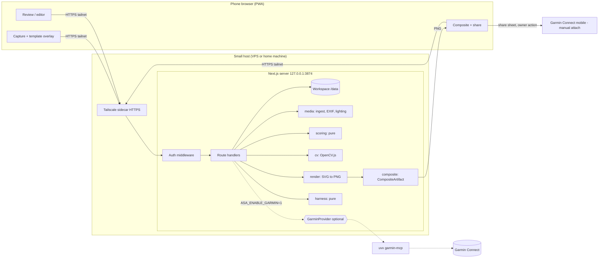

# Plan: Biathlete Training Harness (advanced-shooting-analysis)

Revision 2, 2026-09-13. Inputs: [`DESIGN.md`](DESIGN.md) (verbatim), [`DESIGN-REVISIONS.md`](DESIGN-REVISIONS.md)
(owner decisions: hosted web app, single user, optional Garmin, in-app capture with template overlay), the
reference photos, the owner's example diagrams, and hands-on probing of libraries and Garmin routes.

| Layer | File(s) | Audience |
|---|---|---|
| Intent | `DESIGN.md`, `DESIGN-REVISIONS.md` | Product owner |
| Decisions & reasoning | `PLAN.md` (this file) | Owner, high-tier reviewers |
| Source of truth | `spec/*.md` | Every implementing agent |
| Work units | `milestones/MNN-*.md` + [index](milestones/README.md) | Implementing agents |
| Agent rules | [`/AGENTS.md`](../AGENTS.md) | Every implementing agent |

---

## 1. Product summary

A **phone-first web app on the owner's own small server**, reached privately over HTTPS:

1. After the outing, open the app on the phone and create (or continue) a **biathlon session**.
2. For each paper target, pick **Sighting** or **Precision** and **prone / standing / both**. The camera
   opens with that template's **overlay**. Line up the printed rings and capture.
3. The server stores the photo. The overlay alignment gives the initial calibration, CV proposes shots,
   and the owner corrects them (multiplicity, add/move/remove, position overrides).
4. The app scores the target: ISSF rings /100 or sighting hit/miss, MPI, extreme spread, MOA/MRAD, the
   `both` split, and a pessimistic–optimistic range when rounds are unaccounted for.
5. The owner picks ≤2 sighting + ≤2 precision targets and builds **one composite image**, then **shares or
   saves it** and attaches it to the activity in Garmin Connect mobile.
6. Sources are kept or discarded on the server. The sequence player and harness show trends.
   **Optional:** connect the owner's Garmin account to tag activities, add load metrics, and write an
   analysis text block.

## 2. Verified facts (probed 2026-09-13)

| # | Fact | Consequence |
|---|---|---|
| F1 | Samples are iPhone 16 Pro Max HEIC. `IMG_5057` 3024×4032, 2026-08-24 19:30:09 `-07:00`, BV 5.57, ISO 64, 1/99 s, f/2.2. `IMG_5132` 4284×5712, 2026-09-05 16:56:03 `-07:00`, BV 9.71, ISO 80, 1/3425 s, f/1.78. `Flash`=16 (not fired), WB auto, GPS present. | GPS-free sidecars in `fixtures/reference/*.exif.json` |
| F2 | `exifr` fails (`Unknown file format`) on these HEICs. | Don't use it |
| F3 | Prebuilt `sharp` reads HEIF metadata and the EXIF buffer but **cannot decode HEIC pixels**. `heic-convert` decodes (~1.5 s / 24 MP). | Imports: pixels via `heic-convert`, EXIF via `sharp` + `exif-reader` |
| F4 | `exif-reader` returns `DateTimeOriginal` with the **local wall clock in the UTC fields**. | spec/metadata-lighting.md §1 |
| F5 | `sips` keeps GPS. A `sharp` re-encode strips metadata **and orientation unless `.rotate()` is called first**. | Ingest and privacy tooling call `.rotate()` |
| F6 | `@techstark/opencv-js` (loads in ~30 ms after install) and `@resvg/resvg-js` both work in Node 22. | Server-side CV and rasterisation |
| F7 | Precision sheet = ISSF 50 m rifle geometry (measured ring-1 ≈ 158 mm, black ≈ 113 mm vs 154.4 / 112.4). | spec/geometry-scoring.md §1.3 |
| F8 | Sighting sheet 45 mm ring ≈ 44 mm measured. There is also an unlabelled solid inner circle, Ø ≈ 15 mm. | Listed as unscored |
| F9 | The owner's example diagrams are internally consistent (72/100; 27.7 mm = 1.90 MOA = 0.55 MRAD; 41.9 mm = 2.88 MOA = 0.84 MRAD). Shots traced from them reproduce these exactly. | Golden fixtures `sample-shots-*.json` |
| F10 | Garmin lets users add activity photos **only in the Connect mobile app**. No public or unofficial library uploads photos. | Manual attach (REV-4) |
| F11 | The **Garmin Connect Developer Program is business-only** (its FAQ says "only for business use"). Third parties report new sign-ups paused. | No official route for a personal app |
| F12 | Garmin changed its auth flow in **March 2026**. `garth` is deprecated. `python-garminconnect` 0.3.x logs in via a native engine that impersonates the iOS Connect app (TLS impersonation, bot-check workarounds). `garmin_mcp` @ `655efb8` pins `garminconnect==0.3.2`. | The Garmin feature is optional, own-account only, may break, and is more likely blocked from datacenter IPs |
| F13 | `garmin_mcp` tools: `get_activities_by_date(start_date, end_date, activity_type="", page=0, page_size=100)`, `get_activity(activity_id)`, `get_activities(start, limit)`, `set_activity_description(activity_id, description)` (replaces the whole description). Errors are plain strings starting with `Error`. There are no GPS coordinates in the results. Auth CLI prompts `Enter MFA code: ` and writes tokens to `GARMINTOKENS` **and** `GARMINTOKENS_BASE64`. | spec/garmin-optional.md |
| F14 | Garmin Connect writes workouts to Apple Health, but a web app cannot read Apple Health. | Not used |

## 3. Decisions

| ID | Decision | Why |
|---|---|---|
| D1 | **Next.js App Router web app, mobile-first, installable (PWA manifest).** One server process on a small host. | REV-1. A web stack is the most reliable for lower-tier agents. |
| D2 | pnpm 10, Node 22, Next.js (latest stable, exact-pinned), React, TS strict, Tailwind, shadcn/ui, zod, Vitest, Playwright. | Reproducible toolchain |
| D3 | **Private access over Tailscale.** The app binds `127.0.0.1:3874`; a Tailscale sidecar provides HTTPS (required for the browser camera) on the tailnet only. It is never publicly exposed. | Single user. HTTPS without managing certificates or open ports. |
| D4 | **Defence in depth:** single-user passphrase login (scrypt hash in env, HMAC session cookie), same-origin guard, strict headers, no third-party scripts, fonts, or analytics at runtime. | The server holds photos and (optionally) Garmin tokens |
| D5 | **Storage: JSON + images** in `ASA_WORKSPACE_DIR` (Docker volume `/data`), zod-validated, atomic writes, nightly tar backup. | Simple, inspectable |
| D6 | **In-app capture** with `getUserMedia` and an SVG template overlay (spec/capture-overlay.md). Frames are grabbed from the video to a canvas as JPEG. Fallbacks: native camera `<input capture>`, then import from Photos. | REV-5 |
| D7 | **The overlay produces a calibration prior** stored with the photo, then scaled to the working image. | REV-6. CV only refines near the prior. |
| D8 | **Server-side processing**: `heic-convert` (imports), `sharp`, `exif-reader` (imports), OpenCV.js, `resvg` with bundled Inter fonts. | Verified (F2–F6). Keeps the phone light. |
| D9 | **Manual-first review**: the shot editor ships before CV. CV only proposes. | Dense overlaps are ambiguous |
| D10 | **One SVG renderer** for UI preview, diagram exports, and the composite. | Single visual truth, snapshot tests |
| D11 | **Publish = share or save the `CompositeArtifact`** (Web Share API with files; fallback open-image). A guided card walks through attaching it in Garmin Connect. Server code can only hand out images that are registered composites. | REV-4, REV-7 |
| D12 | **Garmin optional track** (M20 demo + tagging, M21 live). Uses `garmin_mcp` pinned at `655efb8`, per-login temp tokens, MFA over pipes, own account only, off by default (`ASA_ENABLE_GARMIN=0`). | REV-3, F11–F13 |
| D13 | **Fixture privacy**: the repo is public, so original HEICs live in gitignored `fixtures/private/`. Committed images are stripped and downscaled. `pnpm check:privacy` runs in CI. | Photos carry range GPS |

## 4. Corrections and clarifications to the design

| ID | Topic | Resolution |
|---|---|---|
| C1 | Automatic composite upload to Garmin | Not possible with any supported API (F10). Manual attach, per REV-4. |
| C2 | GPS ranking of activities | Not available (F13). Dropped. |
| C3 | "Inner Circle = 10, 1st Ring = 10, 2nd Ring = 9" | ISSF 50 m rifle: inner ten Ø 5.0 (counts as X), 10-ring Ø 10.4, 9-ring Ø 26.4 |
| C4 | Example text "optimistic edge-credit" | The touch rule always applies. Optimistic/pessimistic/averaged are only about unaccounted rounds. |
| C5 | Sighting dotted 40/110 mm guides | hit = hole touches the solid circle; clean = hole centre inside the dotted guide (Q2) |
| C6 | "45 mm inner solid white ring" | A white ring line on paper; the renderer stylises it as a white disc, as in the owner's example |
| C7 | "Position agnostic" label in the example | Every diagram shows its position |
| C8 | `both` + missing rounds | Standing takes the S furthest identified units, so missing rounds fall to prone |
| C9 | Sighting *averaged* = "mean radial error" | Missing units are placed at the identified MPI; expected hits = hit rate × missing |
| C10 | "N rounds marked unresolved" | missing = declared − identified; over-count is a separate warning |
| C11 | Lighting from EXIF | In-app captures have **no EXIF**. Lighting uses local capture hour + image colour cast; EXIF brightness only for imports (spec/metadata-lighting.md §4) |
| C12 | Garmin token handling | `GARMINTOKENS_BASE64` must point inside the temp dir (F13) |

## 5. Enhancements

| ID | Enhancement | Milestone |
|---|---|---|
| E1 | Live template overlay with size slider, dim mask, alignment hint, torch toggle | M07, M08 |
| E2 | Calibration prior from overlay; CV searches only near it | M07, M12 |
| E3 | Capture review screen (retake or use) and a burst workflow (stay in camera for the next target) | M08 |
| E4 | Manual-first shot editor with zoom/pan, multiplicity stepper, per-unit position override | M11 |
| E5 | Sheet fields (athlete name, wind, athlete condition, notes) | M10 |
| E6 | X-count, 2σ group ellipse, mean radius, MPI offset in mm/MOA/MRAD, sight-correction hint once click value is set | M03, M06 |
| E7 | `full` 1500×1700 and `cell` 720×720 render variants | M06 |
| E8 | Web Share of the composite plus a guided Garmin Connect attach card; share history | M15 |
| E9 | Composite JSON sidecar | M14 |
| E10 | CV evaluation script: synthetic targets, owner ground truth, numeric bars | M12, M13 |
| E11 | Dev-only fake camera (`?fakeCamera=`) for deterministic e2e tests | M08 |
| E12 | Seeded demo session (`pnpm seed:demo`) | M11 |
| E13 | Shooting trends harness (precision per position, sighting hit rate, ES MOA, MPI drift) usable without Garmin | M17 |
| E14 | Docker + Tailscale deployment, backups, `check:privacy` in CI | M01, M19 |
| E15 | Quick start straight into the camera (REV-8) | M10, M18 |
| E16 | Auto-review with "Accept with N missing" (REV-9) | M02, M11 |

## 6. Risks

| ID | Risk | L / I | Mitigation |
|---|---|---|---|
| R1 | iOS Safari camera quirks (resolution caps, orientation, PWA standalone mode) | M / M | Spec'd constraints and fallbacks; human device checklist in M08; native-camera fallback |
| R2 | Overlay misalignment by user (tilt, distance) | M / M | Size slider, prior only (editable), CV refine; optional tilt indicator later |
| R3 | CV accuracy on dense overlaps | H / M | Manual-first, multiplicity, range, CV only proposes |
| R4 | Native/wasm packages in Next and Docker | M / M | `serverExternalPackages`, `/api/health` smoke test, Docker build in CI (M19) |
| R5 | Server compromise exposes photos or tokens | L / H | Tailscale-only, passphrase, headers, temp Garmin tokens, no public port |
| R6 | Garmin unofficial login breaks or blocks the host IP | H / L (optional) | Off by default, own account, clear errors, no auto-retry; prefer a home host if used |
| R7 | Low-tier agents drift from spec | M / H | Numeric vectors, exact names, stop-and-ask rule, milestone gates |
| R8 | GPS leakage via the public repo | M / M | D13 |
| R9 | Web Share with files unsupported in some browser | L / L | Open-image fallback with long-press save instructions |

## 7. Architecture

Pure modules (`scoring`, `geometry`, `capture/overlay`, `alignment`, `render`, `harness`) do no I/O.
React components talk to route handlers only and never import server modules.

## 8. Milestones

The index with status is in [`milestones/README.md`](milestones/README.md). There are 22 milestones:
**M01–M19 and M22 are core**, **M20–M21 are the optional Garmin track**.

**Design todo coverage**

| Design todo | Milestones |
|---|---|
| scaffold | M01, M02, M04, M05 |
| garmin-auth-provider | M20, M21 (optional) |
| workflow-link-activity | M10 (sessions), M20 (activity tagging + suggestions) |
| sessions-categorize | M08, M09, M10 |
| cv-scoring | M03, M11, M12, M13 |
| groups-moa | M03, M06 |
| garmin-diagram-upload | M14, M15 (share + manual attach) |
| sequence-player | M16 |
| harness-align | M17, M20 |
| run-demo | M18, M19, M22 |
| **REV-5 capture overlay** | M07, M08 |

## 9. Open questions for the owner

| ID | Question | Default if unanswered |
|---|---|---|
| Q1 | Keep the original HEICs out of this **public** repo (tests needing them skip)? | Keep them out |
| Q2 | Sighting: hole touching the 45/115 mm circle = hit, and dotted 40/110 mm = clean? | Yes (C5) |
| Q3 | Rear-sight click value in mm at 50 m for the correction hint? | Hint hidden until set |
| Q4 | Hole diameter 5.6 mm (.22 LR)? | 5.6 mm |
| Q5 | Composite slot default: most recent, or best score / tightest group? | Most recent, best as tie-break |
| Q6 | Host: small VPS or a home machine? (Home is better if you enable Garmin later, because of F12.) | Either; Docker + Tailscale works for both |
| Q7 | Is Tailscale acceptable as the private access layer (free personal plan)? | Yes |
| Q8 | Optional analysis text block in the Garmin activity description (M21)? | Off by default |

## 10. Definition of done (core)

- `pnpm check`, `pnpm build`, `pnpm test:e2e`, and the Docker build are green in CI.
- On the owner's iPhone over the tailnet: log in → create session → capture a precision and a sighting target
  with the overlay → accept or correct shots → build the composite → share to Photos → attach in Garmin
  Connect → discard sources.
- Seeded golden shots show precision **72/100** and sighting **9 hit / 1 miss** in the diagrams and composite.
- DESIGN delivery checklist mapped to evidence in M22.
