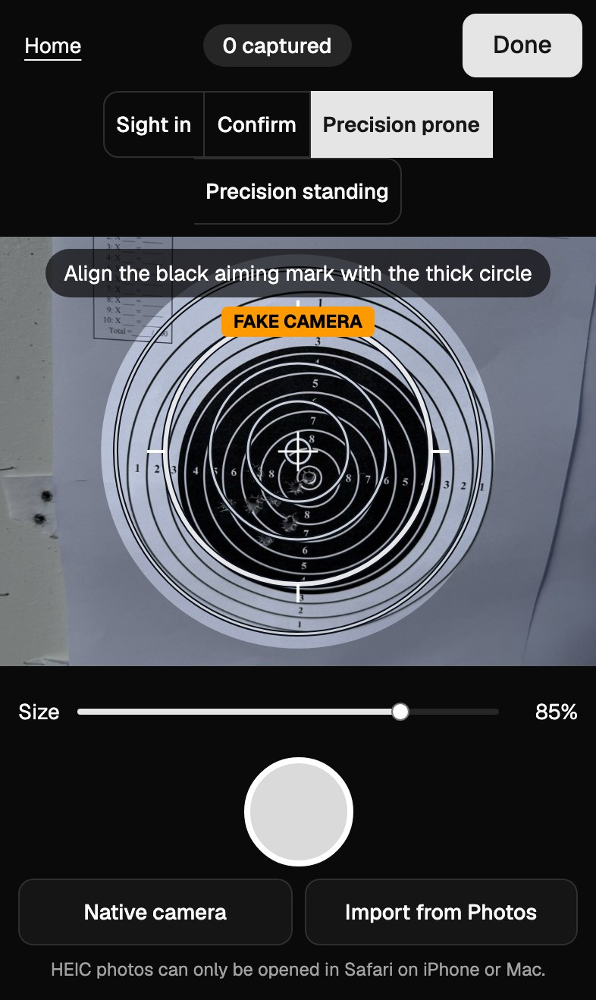
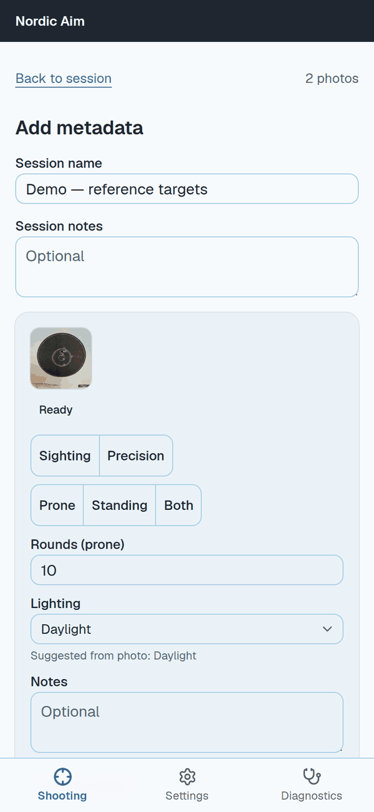
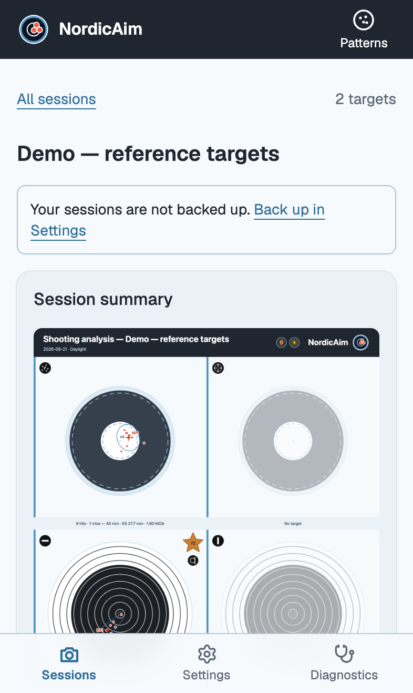
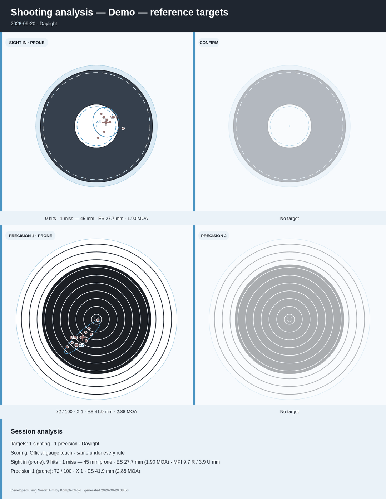
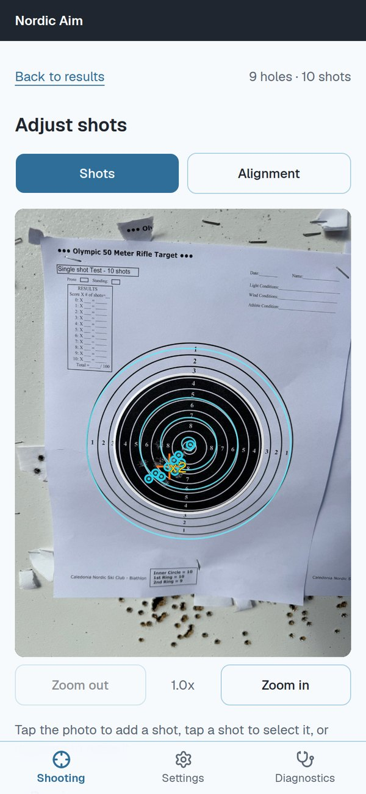
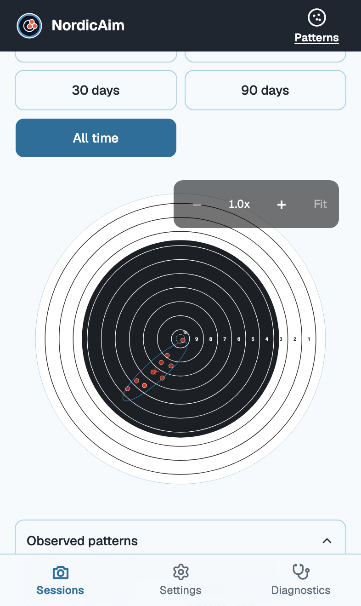
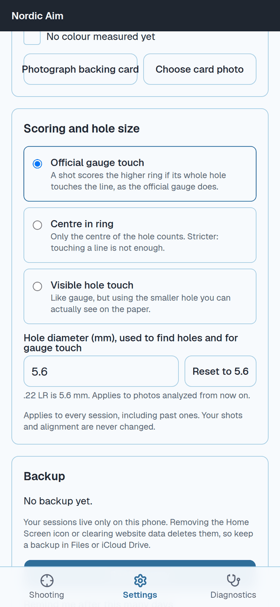

# NordicAim guide

  

Everything you need to go from a shot target to a result you trust. NordicAim runs on your iPhone, needs no account, and never uploads your photos.

Short on time? The **[workflow, step by step](workflow.md)** is the eight-step version.

**In this guide**

1. [Install](#1-install)
2. [Your first session](#2-your-first-session)
3. [Getting a good photo](#3-getting-a-good-photo)
4. [Add the details](#4-add-the-details)
5. [Read the results](#5-read-the-results)
6. [Share the summary image](#6-share-the-summary-image)
7. [Correct a shot or the alignment](#7-correct-a-shot-or-the-alignment)
8. [Review a whole session](#8-review-a-whole-session)
9. [Patterns over time](#9-patterns-over-time)
10. [Settings](#10-settings)
11. [Back up and restore](#11-back-up-and-restore)
12. [If something looks wrong](#12-if-something-looks-wrong)
13. [Words used in NordicAim](#13-words-used-in-nordic-aim)

---

## 1. Install

1. Open [komplexmojo.github.io/NordicAim](https://komplexmojo.github.io/NordicAim/) in **Safari** on your iPhone.
2. Tap **Share**, then **Add to Home Screen**.
3. Open NordicAim from your Home Screen.

Do this on Wi-Fi. The first load downloads the image analysis engine. After that, NordicAim works offline, so you can use it at a range with no signal.

NordicAim has three screens, always one tap apart on the bar at the bottom: **Shooting** (your sessions, photos and results), **Settings**, and **Diagnostics**.

## 2. Your first session

A session is one visit to the range: a sight in, a confirm, one or two precision targets.

1. On the Shooting screen, tap **Start & capture**.
2. Choose the **template** at the top: **Sighting** or **Precision**.
3. Choose the **position**: **Prone**, **Standing** or **Both**.
4. Line the overlay up with the target (see the next section) and tap the round shutter button.
5. Check the photo, then tap **Use photo**. Repeat for each target.
6. Tap **Done**.

Already have a photo? Tap **Import from Photos** instead of the shutter. If you would rather use the iPhone's own camera, tap **Native camera**.

  

## 3. Getting a good photo

The overlay is a drawing of the printed target. The app's own hint says it best: **align the black aiming mark with the thick circle**.

- **Fill the frame with the target.** Use the **Size** slider to match the overlay to the sheet, so the rings line up as closely as you can.
- **Shoot square on.** Stand in front of the target and hold the phone level with it. Steep angles stretch the rings.
- **Keep it sharp and evenly lit.** Steady the phone, and avoid a shadow across the target or glare off the paper.
- **Get the whole target in.** A hole on the paper but outside the scoring rings scores zero and still counts in your group.
- **One target per photo.** Photograph the sighting sheet and the precision sheet separately.

You do not have to get it perfect. NordicAim measures the target in your photo and corrects the alignment itself. If it still misses, you can fix it by hand (see [section 7](#7-correct-a-shot-or-the-alignment)).

Photos taken with the iPhone camera may be in HEIC format. Those open in Safari on iPhone and Mac.

## 4. Add the details

After you tap **Done**, the **Add metadata** screen lists each photo.

| Field | What to put |
|---|---|
| **Session name** | Anything you will recognise later, for example the date or the range. |
| **Session notes** | Optional. Wind, gear, how you felt. |
| **Template** | **Sighting** or **Precision**. |
| **Position** | **Prone**, **Standing** or **Both**. |
| **Rounds** | How many rounds you fired. NordicAim starts from the usual counts, so change it only if yours differ. When you choose **Both**, set the rounds for prone and for standing. |
| **Lighting** | Suggested from the photo. Change it if it is wrong. |
| **Notes** | Optional, for that one target. |

  

Tap **Analyze** when you are ready. Rounds matter: if you fired ten and the photo shows nine holes, NordicAim counts the missing round as a miss and tells you so.

## 5. Read the results

The results screen opens on the **session summary**, with a card for each target below it.

**Sighting targets** show **hits and misses**, for example *9 hits, 1 miss*, and how those hits sit against the zone for your position.

**Precision targets** show **points out of 100** and the **X count**, for example *72 / 100, X 1*, plus a tally of how many shots landed in each ring.

Every target also shows:

- **Extreme spread (ES)**: the widest distance between two shots, in millimetres and MOA.
- **Mean point of impact (MPI)**: the centre of your group. It is shown as a marker on the diagram and as *how far right or left, and how far high or low*, from the centre of the target. This is what to use when you adjust your sights.
- **Shots found**: how many holes NordicAim located, stated separately from your score, so you can see whether it saw every round you fired.

Every target diagram is drawn at the **same scale**, so your sight in, your confirm and your precision targets can be compared by eye. A stray shot outside the drawing is counted (*+N off view*) and appears on the target's detail screen.

Tap a target to open its detail screen, which draws the full target with every shot, including strays.

  

## 6. Share the summary image

The summary image puts your session on one page: the sight in and the confirm across the top, your precision targets below, then a short analysis and how the session was scored.

- If a position has no target, it shows the blank template, marked *No target*.
- The footer credits the app and the developer.

  
   A summary image made from the project's reference target photos.

Tap **Share** to send the image with the iPhone share sheet: save it to Photos, message it to a coach or teammate, or post it to your team's chat. If you have changed anything since, tap **Update summary** first.

The summary image is the only image NordicAim ever hands out. Your original photos stay on your phone.

## 7. Correct a shot or the alignment

NordicAim finds most holes on its own. It is honest about the ones it is unsure of, and you have the final say.

Open a target and tap **Adjust shots**. There are two modes:

- **Shots.** Tap the photo to add a shot, tap a shot to select it, or drag one to move it. To remove a shot, select it and tap **Delete this shot**. Holes the app was unsure about appear as dashed outlines, **suggested holes**. They score nothing until you tap one to confirm it. A hole that looks too wide to be one shot offers a **Looks like 2 shots** button when you select it, so a double punch is one tap.
- **Alignment.** Drag the handles until the drawn rings sit on the printed rings. Use **Zoom in** to be precise.

  

When you are done, tap **Re-analyze**. NordicAim keeps every shot you placed by hand, looks again with the alignment you set, and re-scores. Shots stay on their holes when you move the rings.

If you change a photo's template, for example from Sighting to Precision, NordicAim re-runs the alignment and detection for you, as long as you have not already edited the photo by hand.

## 8. Review a whole session

Tap **Review session** on the results screen to step through the session's photos one at a time. Photos that need attention come first. Each one opens on the same adjust screen, so you can correct a shot, then **Confirm** and move to the next. It is the quickest way to check a session end to end.

## 9. Patterns over time

From the Shooting screen, tap **Patterns: every shot, every session**.

Patterns lays every shot you have recorded over the printed target, one view for each kind of target: **Sight in**, **Confirm**, **Precision prone** and **Precision standing**. Dots are translucent, so where they pile up they darken. Choose **30 days**, **90 days** or **All time**.

  

Under the drawing you get the number of shots, targets and sessions, your mean point of impact, the group ellipse, and either the share of shots in each ring (precision) or the share landing in the hit zone (sighting).

Only analysed targets with a measured or confirmed alignment are counted, and the screen tells you how many were left out. With fewer than ten shots you see the numbers but no ellipse, and it says so. NordicAim shows you the pattern and leaves the conclusions to you and your coach.

## 10. Settings

Everything here applies to **every session**.

**Scoring.** Choose how a shot is scored:

- **Official gauge touch.** A shot scores the higher ring if its whole hole touches the line, as the official gauge does. This is the default.
- **Centre in ring.** Only the centre of the hole counts. Stricter: touching a line is not enough.
- **Visible hole touch.** Like gauge, but using the smaller hole you can actually see on the paper.

Changing the rule **re-scores every session you have stored**. Your shots and alignments are never touched, only how they are read. The summary image always states the rule it used.

**Hole size.** The diameter of a hole, used to find holes and for the gauge rule. The default is 5.6 mm, a .22 hole.

**Backing sheet.** Some shooters put a brightly coloured sheet behind the target, so every hole shows that colour. Leave **Backing** on **Auto** and NordicAim decides for each photo. If you use a coloured backing, tap **Photograph backing card** (or **Choose card photo**) and photograph a card of the same colour, so NordicAim can use the colour to find holes more cleanly. The card photo itself is not kept.

**Backup.** See the next section.

  

## 11. Back up and restore

Your sessions are stored only on your phone. If you delete the Home Screen app or clear Safari's website data, they are gone.

- In **Settings**, tap **Back up now** to save everything to one file. Use the share sheet to save it to Files or send it to yourself.
- NordicAim reminds you when you have never backed up, or when the last backup is more than 14 days old (you can change the number of days).
- To restore, choose the backup file in Settings. NordicAim checks the whole file first and shows you what it contains. If something on the phone differs from the backup, you choose per item whether to keep what is on the phone or replace it. Nothing is written until the file passes its checks.

A backup file contains your photos, and those hold their location. NordicAim tells you this before it creates the file. Keep the file somewhere you trust.

## 12. If something looks wrong

- **Rings are off the printed rings.** Open the target, tap **Adjust shots**, choose **Alignment** and drag the handles, then **Re-analyze**.
- **A hole was missed.** In **Shots**, tap the hole to add it, or tap a dashed suggested hole to confirm it.
- **You fired two shots through one hole.** In **Shots**, select the hole and tap **Looks like 2 shots**. If you entered fewer rounds than holes, NordicAim may assume a double punch for you. Set the hole back to 1 shot to score the extra round as a miss instead.
- **A shot scores lower than you expect on the paper.** Check the scoring rule in **Settings**. Official gauge touch and centre in ring can differ by a ring on a line.
- **Fewer shots than rounds.** A declared round with no hole found is counted as an assumed miss. Add any hole you can see, or correct the round count in the metadata.
- **Something failed to open or save.** Open **Diagnostics** on the bottom bar. It runs checks on your phone (storage, camera, sharing, the analysis engine) and shows which pass and which fail, and lets you export your data.

Found a bug or a score that looks wrong? [Open an issue](https://github.com/KomplexMojo/NordicAim/issues) and say what you shot and what you expected.

## 13. Words used in NordicAim

| Term | Meaning |
|---|---|
| **Sight in** | The first sighting target of a session, shot to set your sights. |
| **Confirm** | A later sighting target, shot to confirm the sights. |
| **Precision** | The Olympic 50 m rifle target, scored out of 100. |
| **Prone / Standing / Both** | Shooting position. **Both** splits the target's rounds between the two. |
| **X** | A shot in the inner ten. Counts as 10 and is tallied separately. |
| **ES** | Extreme spread: the widest distance between two shots in the group. |
| **MPI** | Mean point of impact: the average position of your shots, relative to the target centre. |
| **MOA** | Minute of angle. At 50 m, one MOA is about 14.5 mm. |
| **Group ellipse** | The oval that best fits your group, drawn on the diagram. |
| **Suggested hole** | A hole NordicAim was unsure about. It scores nothing until you confirm it. |
| **Alignment** | How the drawn target sits on your photo. |
