# NordicAim guide

  

Everything you need to go from a shot target to a result you trust. NordicAim runs on your iPhone, needs no account, and never uploads your photos.

Short on time? The **[workflow, step by step](workflow.md)** is the eight-step version.

**In this guide**

1. [Install](#1-install)
2. [Your first session](#2-your-first-session)
3. [Getting a good photo](#3-getting-a-good-photo)
4. [Add the details](#4-add-the-details)
5. [Read the results](#5-read-the-results)
6. [Share the summary image](#6-share-the-summary-image)
7. [Correct a shot or the alignment](#7-correct-a-shot-or-the-alignment)
8. [Review a whole session](#8-review-a-whole-session)
9. [Patterns over time](#9-patterns-over-time)
10. [Trends and the coach image](#10-trends-and-the-coach-image)
11. [Seasons](#11-seasons)
12. [Goals](#12-goals)
13. [The Board](#13-the-board)
14. [Settings](#14-settings)
15. [Back up and restore](#15-back-up-and-restore)
16. [If something looks wrong](#16-if-something-looks-wrong)
17. [Words used in NordicAim](#17-words-used-in-nordicaim)

---

## 1. Install

1. Open [komplexmojo.github.io/NordicAim](https://komplexmojo.github.io/NordicAim/) in **Safari** on your iPhone.
2. Tap **Share**, then **Add to Home Screen**.
3. Open NordicAim from your Home Screen.

Do this on Wi-Fi. The first load downloads the image analysis engine. After that, NordicAim works offline, so you can use it at a range with no signal.

The bar at the bottom has five screens, always one tap apart: **Sessions** (your sessions, photos and results), **Analysis** (your trends over time), **Patterns** (every shot, every session), **Goals** (where you want your numbers to be) and **Board** (your best targets against other shooters'). **Settings** is the gear at the top right, and **Diagnostics** is at the bottom of Settings.

## 2. Your first session

A session is one visit to the range: a sight in, a confirm, one or two precision targets. On the Sessions screen, each session's row shows the marks of the targets it holds (up to four, one per target; past that, one per kind with a count), so a session missing a target stands out. A plain ring is a target whose kind isn't chosen yet. The row of season buttons above the list shows only one season's sessions (see [section 11](#11-seasons)).

  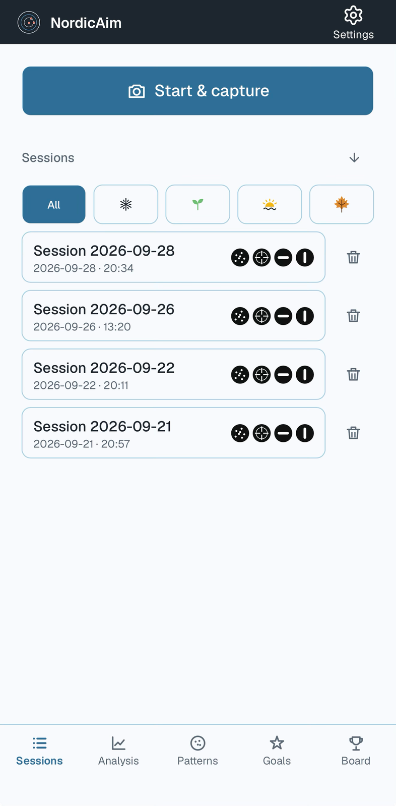

1. On the Sessions screen, tap **Start & capture** (or **Capture (today's session)** if you already started one today).
2. Choose what you are photographing: **Sight in**, **Confirm**, **Precision prone** or **Precision standing**. Each button carries the mark that kind of target has everywhere in the app: a scatter for sight in, a scope sight for confirm, a flat bar for prone and an upright bar for standing.
3. Line the overlay up with the target (see the next section) and tap the round shutter button.
4. Check the photo, then tap **Use photo**. Repeat for each target, choosing its type each time.
5. Tap **Done**.

Already have a photo? Tap **Import from Photos** instead of the shutter. If you would rather use the iPhone's own camera, tap **Native camera**.

  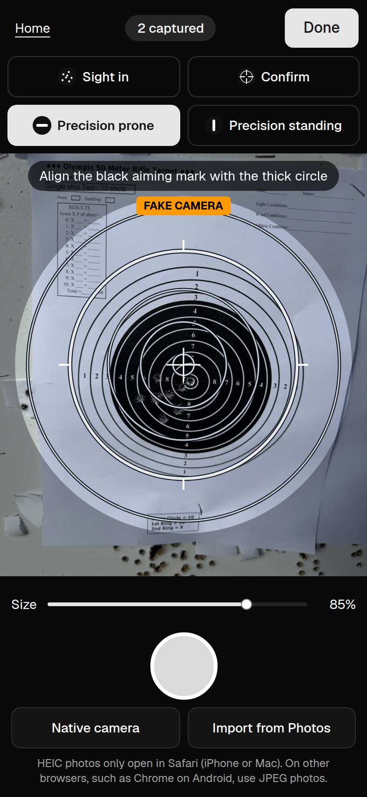

## 3. Getting a good photo

The overlay is a drawing of the printed target. The app's own hint says it best: **align the black aiming mark with the thick circle**.

- **Fill the frame with the target.** Use the **Size** slider to match the overlay to the sheet, so the rings line up as closely as you can.
- **Shoot square on.** Stand in front of the target and hold the phone level with it. Steep angles stretch the rings.
- **Keep it sharp and evenly lit.** Steady the phone, and avoid a shadow across the target or glare off the paper.
- **Get the whole target in.** A hole on the paper but outside the scoring rings scores zero and still counts in your group.
- **One target per photo.** Photograph the sighting sheet and the precision sheet separately.

You do not have to get it perfect. NordicAim measures the target in your photo and corrects the alignment itself. If it still misses, you can fix it by hand (see [section 7](#7-correct-a-shot-or-the-alignment)).

Photos taken with the iPhone camera may be in HEIC format. Those open in Safari on iPhone and Mac; on other browsers (for example Chrome on Android) use JPEG photos.

## 4. Add the details

After you tap **Done**, the **Add metadata** screen lists each photo.

| Field | What to put |
|---|---|
| **Session name** | Anything you will recognise later, for example the date or the range. |
| **Session date** | The day you shot. A new session gets today's date; change it here to record a session from an earlier day. A name like *Session 2026-09-29* follows the new date; a name you typed is kept. |
| **Session notes** | Optional. Wind, gear, how you felt. |
| **Target type** | **Sight in**, **Confirm**, **Precision prone** or **Precision standing**, already set if you chose it when you took the photo. |
| **Rounds** | How many rounds you fired. NordicAim starts from the usual counts (ten, or five for a confirm), so change it only if yours differ. |
| **Lighting** | Suggested from the photo. Change it if it is wrong. |
| **Season** | Suggested from the date. |
| **Notes** | Optional, for that one target. |

  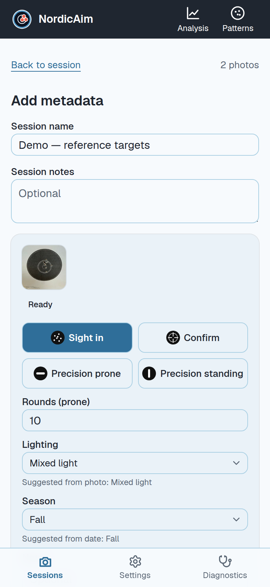

Tap **Analyze** when you are ready (the button says how many targets). Rounds matter: if you fired ten and the photo shows nine holes, NordicAim counts the missing round as a miss and tells you so.

## 5. Read the results

The results screen opens with two buttons: **Review session** (next section) and, beside it, **Edit metadata**, to go back and change the session's name, date, notes or a target's details. Below them is the **session summary**, with a card for each target.

**Sighting targets** show **hits and misses**, for example *9 hits, 1 miss*, and how those hits sit against the zone for your position.

**Precision targets** show **points out of 100** and the **X count**, for example *72 / 100, X 1*, plus a tally of how many shots landed in each ring.

Every target also shows:

- **Extreme spread (ES)**: the widest distance between two shots, in millimetres and MOA.
- **Mean point of impact (MPI)**: the centre of your group. It is shown as a marker on the diagram and as *how far right or left, and how far high or low*, from the centre of the target. This is what to use when you adjust your sights.
- **Shots found**: how many holes NordicAim located, stated separately from your score, so you can see whether it saw every round you fired.

Every target diagram is drawn at the **same scale**, so your sight in, your confirm and your precision targets can be compared by eye. A stray shot outside the drawing is counted (*+N off view*) and appears on the target's detail screen.

Tap a target's picture to open its own screen, which draws the full target with every shot, including strays, and is where you correct it (see [section 7](#7-correct-a-shot-or-the-alignment)).

  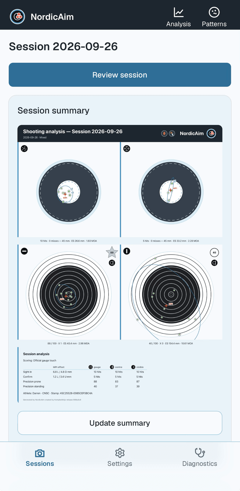

## 6. Share the summary image

The summary image puts your session on one page: the sight in and the confirm across the top, your precision targets below, then a short analysis and how the session was scored.

- If a position has no target, it shows the blank template, marked *No target*.
- The footer credits the app and the developer.

  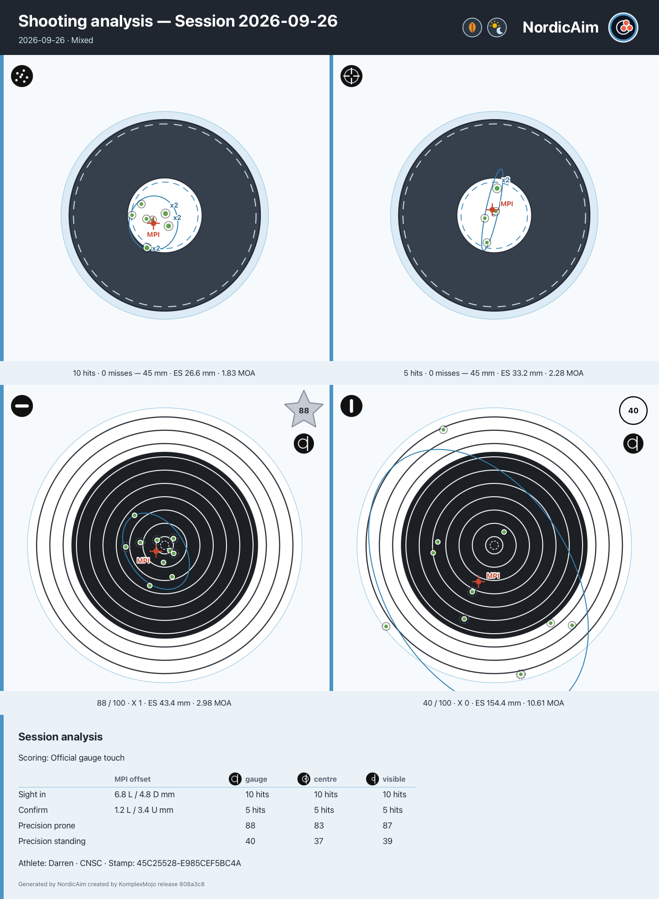
   A summary image from a real range session.

Tap **Share** to send the image with the iPhone share sheet: save it to Photos, message it to a coach or teammate, or post it to your team's chat. If you have changed anything since, tap **Update summary** first.

Only two images ever leave NordicAim, and only when you tap **Share**: this summary image, and the coach image from the Analysis screen (see [section 10](#10-trends-and-the-coach-image)). Your original photos stay on your phone. The Board shares files too, never images: names, clubs and shot positions, only when you tap (see [section 13](#13-the-board)).

## 7. Correct a shot or the alignment

NordicAim finds most holes on its own. It is honest about the ones it is unsure of, and you have the final say.

Tap a target's picture on the results screen. Its screen shows your photo with the drawn rings and every shot on it, and two modes:

- **Shots.** Tap the photo to add a shot, tap a shot to select it, or drag one to move it. To remove a shot, select it and tap **Delete this shot**. A hole that looks too wide to be one shot offers a **Looks like 2 shots** button when you select it, so a double punch is one tap.
- **Alignment.** Drag the handles until the drawn rings sit on the printed rings. Use **+** to zoom in and be precise.

Under the photo, the **Swipe** and **Fade** sliders compare the drawing with your photo: swipe between them, or fade the drawing to see the paper underneath.

  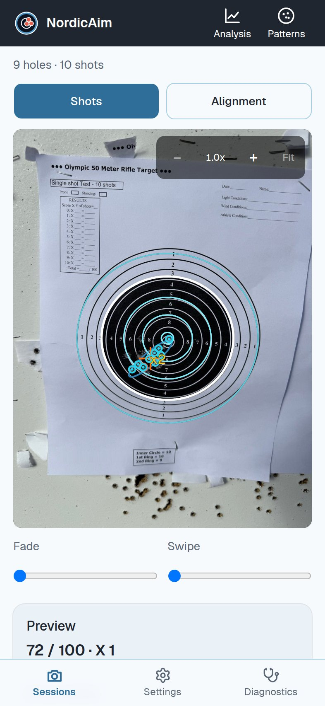

When you are done, tap **Save** (or **Save and re-analyze** after you moved the rings). NordicAim keeps every shot you placed by hand, looks again with the alignment you set, and re-scores. Shots stay on their holes when you move the rings.

The first time you correct a precision target by hand, NordicAim keeps the score it found on its own. From then on, the target's screen shows an **Edited by hand** note with both scores, for example *automatic 70% → yours 82% (+12)*. A correction that moves the score by more than 10 points, either way, is **flagged** on the Board (see [section 13](#13-the-board)). It still counts: the flag only says the score rests on your corrections. A target corrected before NordicAim kept automatic scores says so, as there is nothing to compare it with.

  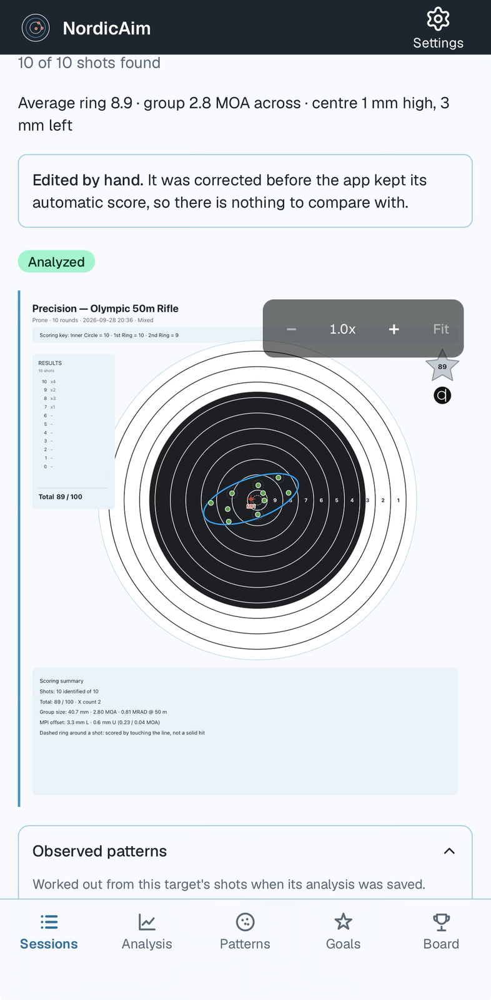

If you change a photo's target type, for example from Sight in to Precision prone (**Edit type, rounds, lighting** on its screen), NordicAim re-runs the alignment and detection for you, as long as you have not already edited the photo by hand.

## 8. Review a whole session

Tap **Review session** on the results screen to step through the session's photos one at a time. Photos that need attention come first. Each one opens on the same adjust screen, so you can correct a shot, then **Confirm** and move to the next. It is the quickest way to check a session end to end.

## 9. Patterns over time

Tap **Patterns** on the bottom bar.

Patterns lays every shot you have recorded over the printed target, one view for each kind of target: **Sight in**, **Confirm**, **Precision prone** and **Precision standing**. Dots are translucent, so where they pile up they darken.

The slider under the views picks how far back to look. From left to right: **-∞** (all time), **-90**, **-30**, **-14** and **-7** days, then **1**, the latest session. The season row below it narrows that to one season (see [section 11](#11-seasons)).

  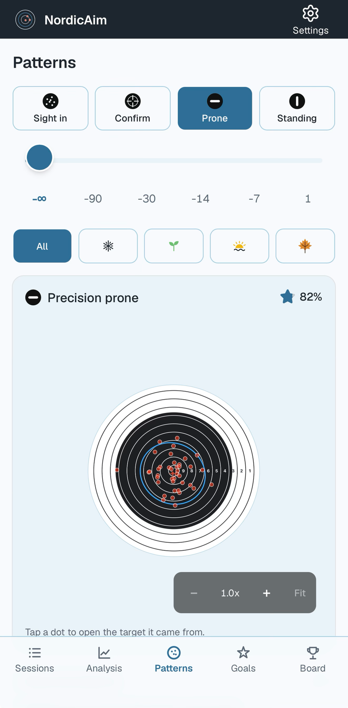

Under the drawing you get the number of shots, targets and sessions, your mean point of impact, the group ellipse, and either the share of shots in each ring (precision) or the share landing in the hit zone (sighting).

Only analysed targets with a measured or confirmed alignment are counted, and the screen tells you how many were left out. With fewer than ten shots you see the numbers but no ellipse, and it says so. NordicAim shows you the pattern and leaves the conclusions to you and your coach.

Tap a dot to see which target it came from: a list opens under the drawing with each target under your finger and **Open target**. From that target, **Back to Patterns** returns you to the same view and range.

## 10. Trends and the coach image

Tap **Analysis** on the bottom bar. It uses the same kinds of target and the same date ranges as Patterns, but where Patterns shows *where* your shots land, Analysis shows *how your numbers move*, with **one point per session**. Tap a point to read its value; under the chart you can then open that session's target, and **Back to Analysis** brings you back to the same view.

  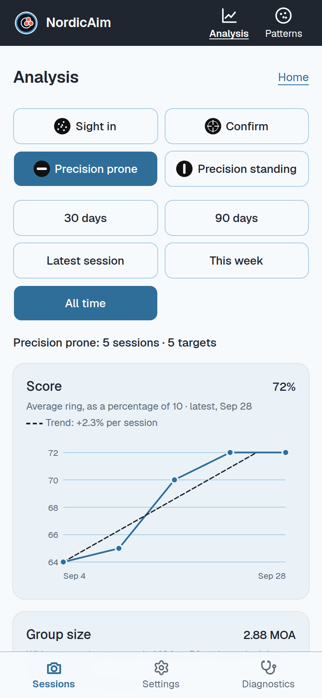
  &nbsp;
  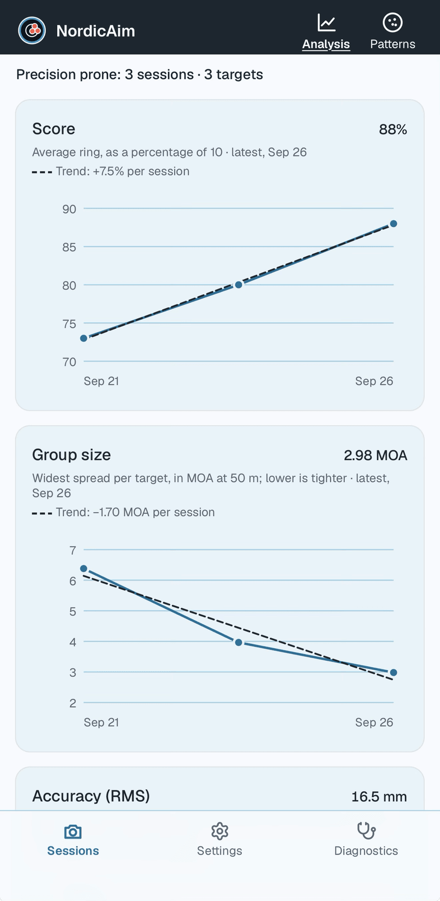

There is one chart for each measure:

- **Score** (precision: the average ring, as a percentage of 10) or **Hit rate** (sighting: the share of shots in the hit zone). Higher is better.
- **Group size**: the widest spread on each target, averaged over the session, in MOA at 50 m. Lower is tighter.
- **Accuracy (RMS)**: the root-mean-square distance of every shot from the centre, in millimetres. It is one number for how close to the centre your shots land, combining how big the group is and how far off centre it sits. Lower is closer.
- **MPI left / right** and **MPI up / down**: where the centre of your group sits, in millimetres. 0 is centred.

From three sessions, the Score (or Hit rate), Group size and Accuracy charts draw a dashed **trend line**, the straight line that best fits your sessions, and say how much it changes per session, for example *Trend: −0.3 mm per session*. The MPI charts have no trend line: they show which side of centre each session sat, and a line through the middle cannot tell swapping sides from getting closer. Whether you are getting closer to the centre shows in Accuracy. Tap a point to read that session's value.

**The coach image.** Tap **Make coach image**, then **Share**, to send a coach one picture of the range you chose: the four Patterns drawings, then for each kind of target a row of small boxes with its **average** over the range: score or hit rate, group size, accuracy, and a small bullseye with the target's mark placed where its average shot lands, each session's own average as a faint dot, and how far off a session typically sits. That matters when sessions land on different sides: they can average to *centred* when none of them was. A tiny arrow on each box shows which way the trend is going: tilted up, level or down, green when it is improving and red when it is getting worse. The charts themselves stay on the Analysis screen, where a coach can look at them with you.

  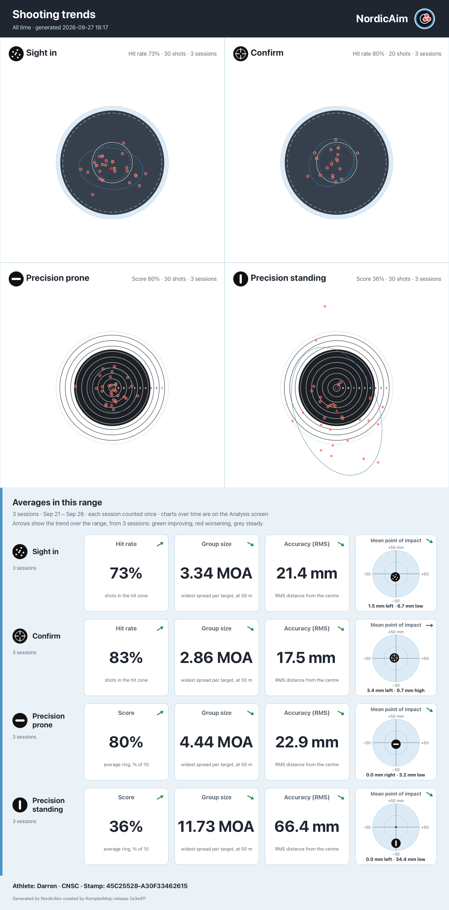
   A coach image of three range sessions.

## 11. Seasons

Sessions, Patterns, Analysis and Goals each have a row of five buttons: **All**, then **Winter** (a snowflake), **Spring** (a sprout), **Summer** (the sun on the water) and **Fall** (a maple leaf). Tap one to see only that season. **All** shows everything again.

- A target's season is the one you chose for its photo in **Add metadata**. Without one, it follows the day the photo was taken, then the session date.
- On Patterns and Analysis the season works with the date slider: the season is chosen first, then the range. **1** under Winter is your latest winter session, and **-30** under Summer is the summer sessions of the last 30 days.
- On the Sessions screen, a session shows under a season when any of its targets belongs to it.

## 12. Goals

Tap **Goals** on the bottom bar. Choose **Prone** or **Standing**, then set where you want each measure to be: **Score**, **Group size**, **Accuracy (RMS)** and **Biathlon hits** (the share of your shots that would hit the biathlon hit zone: 45 mm prone, 115 mm standing).

  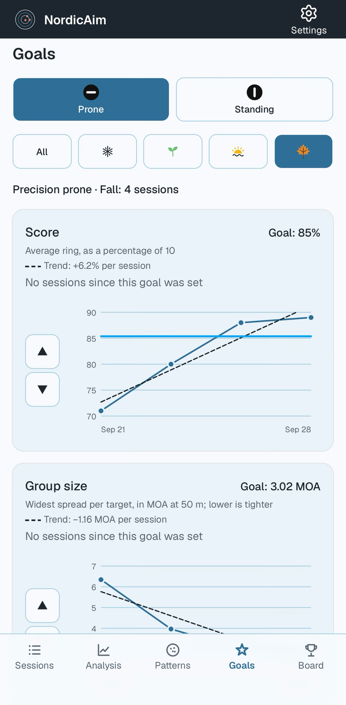

Each chart plots every session, with the dashed trend line from three sessions, as on Analysis. Tap **▲** or **▼** beside a chart to move its goal, drawn as a solid blue line. Each tap saves at once.

Under the title, the chart says how you are doing **since you set the goal**: *Average since set: 87% over 3 sessions · Hit*, or *· Not yet*. Until you shoot a session after setting it, it says *No sessions since this goal was set*. Changing a goal starts that count again.

**Did a session meet its goals?** Each session is judged against the goals you had set **when the session was created**. A goal set later never reaches back, so a session's checks don't change when you change your goals. A session with goals in effect shows a **Goals** card on its results, with a ✓ or ✗ for each goal. Its summary image gains a Goals table and a green seal on each precision target whose goals were all met. On the Goals charts, the dot of a session that met its goal is ringed in green.

## 13. The Board

The Board ranks shooters by the **average of their best 5 precision targets**, one board for **Prone** and one for **Standing**. There is no server: boards travel as files you share and import, so each phone holds its own board.

  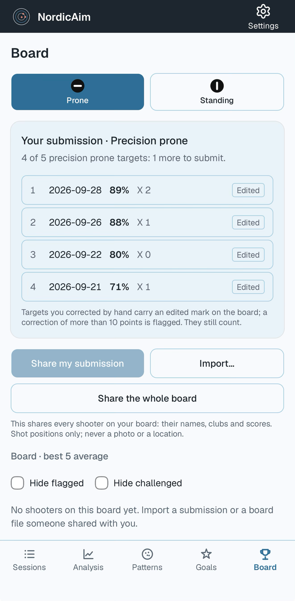

**Your submission.** The top of the Board shows what you would submit for the chosen position: your best 5 analysed precision targets **of all time**, picked for you, and their average. You need five targets for a position before you can submit it. Tap a target to open it. Every phone scores board targets the same way, by the official gauge with a 5.6 mm hole, so the board is fair whatever your scoring rule in Settings.

**Edited and Flagged.** A target you corrected by hand (a shot or the alignment) carries an **Edited** mark. A correction that moved its score by more than 10 points is also **Flagged** (see [section 7](#7-correct-a-shot-or-the-alignment)). Both still count. They tell everyone how the score was made.

**Share and import.**

- **Share my submission** sends your entry as a file from the share sheet. It needs your **name** in Settings and your **stamp passphrase**, which signs the file. Any change made to it after signing is caught, and that submission is turned away on import.
- **Import…** opens a file someone shared with you: one shooter's submission or a whole board. NordicAim checks every signature, scores every target again from its shot positions, and shows what would change, for example *1 new shooter, 0 updated, 1 already on your board*. Nothing is saved until you tap **Add to my board**.
- **Share the whole board** sends every shooter on your board in one file, so one person can collect submissions and pass the board on.

A newer submission from the same shooter replaces the older one, and importing the same file twice changes nothing. A board keeps the best 100 shooters.

  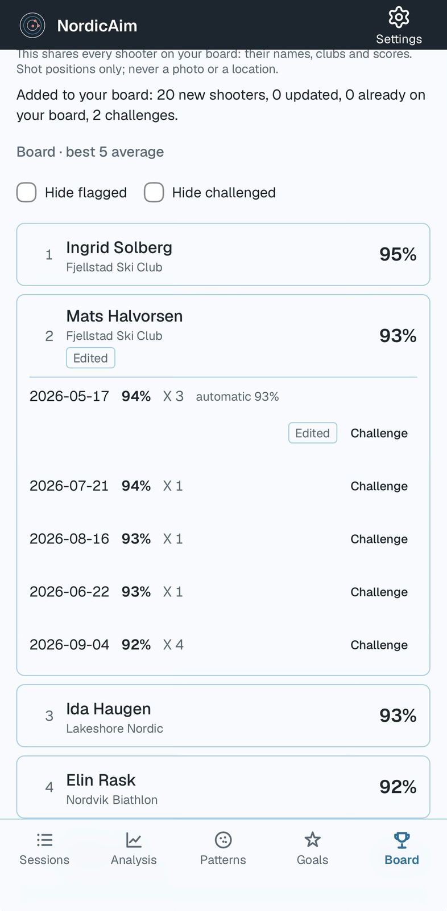
  &nbsp;
  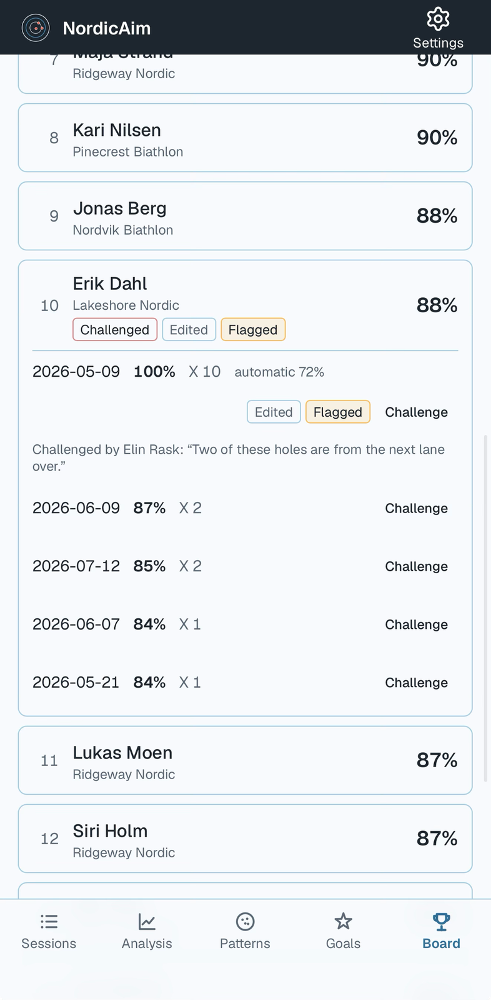

**Reading the board.** Each row shows the shooter, their club, their marks and their average in the same star as a session's score: gold above 90, silver from 80, bronze from 70, a plain circle below. The top scorer has a **trophy** in place of *1*. Ties go to more Xs, then the smaller group, then the earlier date. Once you have five targets for a position, your own row joins the board: highlighted, marked *(you)*, and always showing your current best 5. Tap a row to open its five targets: the date, the score and the X count, and for a corrected target, its automatic score too.

**Challenges.** If a target looks wrong to you, say a hole from the next lane, tap **Challenge** beside it and write why. Your challenge is signed with your passphrase and saved on your board. Share it so the shooter and others see it. The entry is then marked **Challenged**, with each reason under its target. When the shooter shares a newer submission, it answers the challenge, and the challenge is dropped. **Hide flagged** and **Hide challenged** take those entries off your view of the board. Your own row always shows.

What a submission holds: your name, club, the dates, rounds, marks and shot positions of five targets. Never a photo, never a location. A full backup keeps the boards and challenges you received (see [section 15](#15-back-up-and-restore)).

## 14. Settings

Everything here applies to **every session**.

**Athlete.** Your **name** and **ski club** print on the summary and coach images. Set your **handedness** so NordicAim describes a group as towards your trigger or sling side. A **passphrase** (at least 12 characters) creates a stamp on each image, so anyone can check with **Verify a stamp** that it came from you and was not edited. The passphrase is never stored and never backed up, so keep a note of it.

  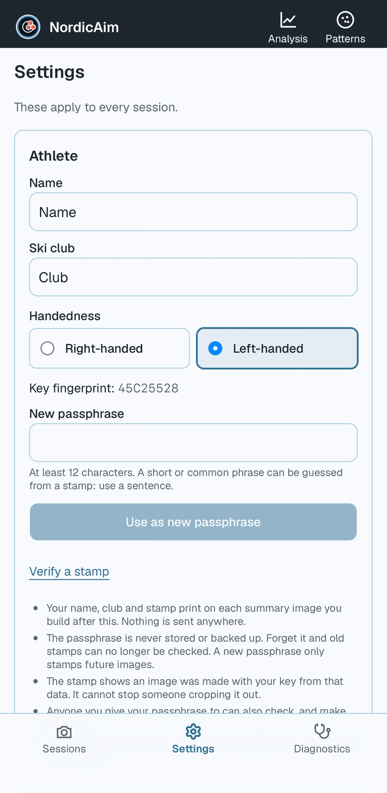

**Scoring.** Choose how a shot is scored:

- **Official gauge touch.** A shot scores the higher ring if its whole hole touches the line, as the official gauge does. This is the default.
- **Centre in ring.** Only the centre of the hole counts. Stricter: touching a line is not enough.
- **Visible hole touch.** Like gauge, but using the smaller hole you can actually see on the paper.

Changing the rule **re-scores every session you have stored**. Your shots and alignments are never touched, only how they are read. The summary image always states the rule it used.

**Hole size.** The diameter of a hole, used to find holes and for the gauge rule. The default is 5.6 mm, a .22 hole.

  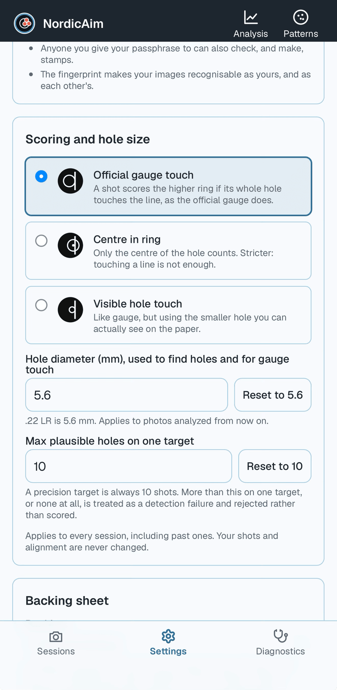

**Backing sheet.** Some shooters put a brightly coloured sheet behind the target, so every hole shows that colour. Leave **Backing** on **Auto** and NordicAim decides for each photo. If you use a coloured backing, tap **Photograph backing card** (or **Choose card photo**) and photograph a card of the same colour, so NordicAim can use the colour to find holes more cleanly. The card photo itself is not kept.

**Target sheets.** NordicAim ships with a picture of each printed sheet. When your printed sheets change, photograph a blank, unused sheet so it matches exactly what you shoot at; only the target circles are kept. **Restore default** goes back to the built-in sheet.

**Printable sheets.** Each row also has **Download printable sheet (PDF)**: NordicAim's own training sheets, one PDF per template (sighting: Sight in and Confirm; precision: Prone and Standing). They work offline once the app is installed. Print them on US Letter at **100% / Actual size**, and check that the bar at the bottom measures exactly 100 mm. Card stock tears cleaner holes than printer paper. Each page has its kind's mark and name at the top centre (Sight in, Confirm, Precision prone, Precision standing), so a hung sheet is easy to tell apart; on a clipboard the clamp covers it. Photograph all four corner markers with the target. The app reads them: an imported photo with no kind yet takes the sheet's kind, and if the rings don't line up with the markers the target is flagged with *The sheet's corner markers don't match the alignment* so you can check it in Adjust (saving there clears it).

**Backup.** See the next section.

## 15. Back up and restore

Your sessions are stored only on your phone. If you delete the Home Screen app or clear Safari's website data, they are gone.

- In **Settings**, tap **Back up now** to save everything to one file. Use the share sheet to save it to Files or send it to yourself.
- A backup of everything also keeps the board submissions and challenges you received. A backup of chosen sessions leaves them out.
- To save or send just some sessions (one range day, say), choose **Choose sessions** in the same dialog and tick the ones you want. The file is much smaller and its name ends with how many sessions it holds, for example `…-2026-09-30-1-session.json.gz`. It doesn't count as your backup, so the reminder still waits for a backup of everything.
- The file is compressed and named after you and the day, for example `nordic-aim-backup-jane-doe-3FA91C07-2026-09-27.json.gz`: your name, your key fingerprint if you set a passphrase, and the date. To keep it small, it holds each original photo once; the smaller copies NordicAim works from are made again when you restore. When it is done, Settings tells you the size, and the size before compression.
- NordicAim reminds you when you have never backed up, or when the last backup is more than 14 days old (you can change the number of days).
- To restore, tap **Choose backup file…** in Settings and pick the file. NordicAim checks the whole file first and shows you what it contains. If something on the phone differs from the backup, you choose whether to keep what is on the phone or replace it. Nothing is written until the file passes its checks. Your settings and preferences come back too; enter your passphrase again afterwards to keep stamping images.
- Restore in **Safari on your iPhone**. Remaking the photo copies needs a browser that can open iPhone (HEIC) photos, and if one cannot be made, nothing is changed. Older backups (`.json`) still restore.

  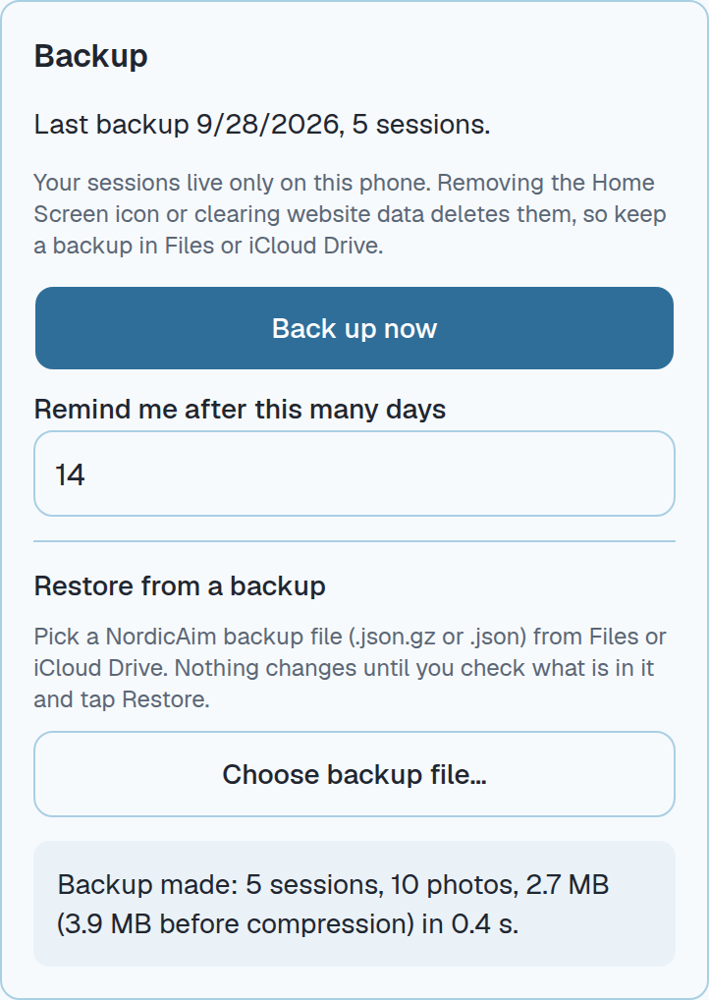

A backup file contains your photos, and those hold their location. NordicAim tells you this before it creates the file. Keep the file somewhere you trust.

## 16. If something looks wrong

- **Rings are off the printed rings.** Open the target (tap its picture), choose **Alignment** and drag the handles, then **Save and re-analyze**.
- **A hole was missed.** In **Shots**, tap the hole to add it.
- **You fired two shots through one hole.** In **Shots**, select the hole and tap **Looks like 2 shots**. If you entered fewer rounds than holes, NordicAim may assume a double punch for you. Set the hole back to 1 shot to score the extra round as a miss instead.
- **A shot scores lower than you expect on the paper.** Check the scoring rule in **Settings**. Official gauge touch and centre in ring can differ by a ring on a line.
- **Fewer shots than rounds.** A declared round with no hole found is counted as an assumed miss. Add any hole you can see, or correct the round count in the metadata.
- **Something failed to open or save.** Open **Settings** (the gear at the top right), then **Diagnostics** at the bottom. It runs checks on your phone (storage, camera, sharing, the analysis engine) and shows which pass and which fail, and lets you export your data.

Found a bug or a score that looks wrong? [Open an issue](https://github.com/KomplexMojo/NordicAim/issues) and say what you shot and what you expected.

## 17. Words used in NordicAim

| Term | Meaning |
|---|---|
| **Sight in** | The first sighting target of a session, shot to set your sights. |
| **Confirm** | A later sighting target, shot to confirm the sights. |
| **Precision** | The Olympic 50 m rifle target, scored out of 100. |
| **Target type** | Sight in, Confirm, Precision prone or Precision standing: what you shot, chosen for each photo. |
| **Prone / Standing** | Shooting position. |
| **X** | A shot in the inner ten. Counts as 10 and is tallied separately. |
| **ES** | Extreme spread: the widest distance between two shots in the group. |
| **MPI** | Mean point of impact: the average position of your shots, relative to the target centre. |
| **MOA** | Minute of angle. At 50 m, one MOA is about 14.5 mm. |
| **Accuracy (RMS)** | Root-mean-square distance of your shots from the centre of the target: one number for how close they land. |
| **Trend line** | On the Analysis charts, the straight line that best fits your sessions, from three sessions. |
| **Coach image** | One image of a date range: the Patterns drawings and your averages, with trend arrows. |
| **Group ellipse** | The oval that best fits your group, drawn on the diagram. |
| **Alignment** | How the drawn target sits on your photo. |
| **Season** | Winter, Spring, Summer or Fall: a filter on Sessions, Patterns, Analysis and Goals. |
| **Goal** | Where you want a measure to be, for Prone or Standing. A session is judged against the goals set when it was created. |
| **Board** | Shooters ranked by the average of their best 5 precision targets, shared as signed files. |
| **Edited** | A target corrected by hand: a shot or the alignment. |
| **Flagged** | A correction that moved a target's score by more than 10 points. It still counts. |
| **Challenge** | A signed note from another shooter saying a board target looks wrong, and why. |
