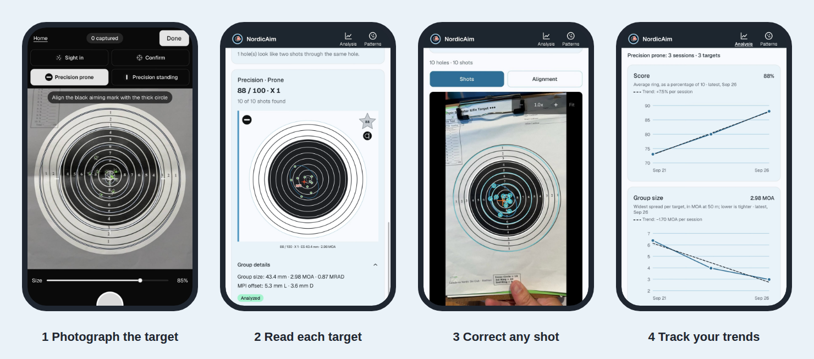

# The NordicAim workflow

  

The whole thing in eight steps. Steps 1 to 3 you do once. Steps 4 to 8 you repeat every time you shoot.

| | Step | When |
|---|---|---|
| 1 | [Install the app](#1-install-the-app) | Once |
| 2 | [Set up your athlete details](#2-set-up-your-athlete-details) | Once |
| 3 | [Get your kit: coloured backing paper and a clipboard](#3-get-your-kit) | Once |
| 4 | [Shoot your session](#4-shoot-your-session) | Every session |
| 5 | [Photograph each target on the backing paper](#5-photograph-each-target) | Every session |
| 6 | [Review the photos and adjust](#6-review-the-photos-and-adjust) | Every session |
| 7 | [Generate the analysis](#7-generate-the-analysis) | Every session |
| 8 | [Review the session against your patterns and trends](#8-review-the-session-against-your-patterns-and-trends) | Every session |

## 1. Install the app

1. Open [komplexmojo.github.io/NordicAim](https://komplexmojo.github.io/NordicAim/) in **Safari** on your iPhone.
2. Tap **Share**, then **Add to Home Screen**.
3. Open NordicAim from your Home Screen.

Do this on Wi-Fi. The first load downloads the image analysis engine. After that it works offline at the range.

## 2. Set up your athlete details

Open **Settings**, the gear at the top right. Under **Athlete**, fill in:

- **Name** and **Ski club**, which appear on the summary and coach images you share, and name your backup files.
- **Handedness**, right-handed or left-handed.
- **Passphrase**, at least 12 characters. It creates the stamp that lets anyone check a summary image really came from you and was not edited, the key fingerprint in your backup file names, and the signature on your Board submission. The passphrase itself is never stored and never leaves the phone, so keep a note of it somewhere safe.

  

While you are in Settings, check the **scoring rule** and, if you use one, set up your **backing sheet** (see the next step).

## 3. Get your kit

You need two cheap things:

- **A sheet of coloured backing paper.** Put it behind the target. Every hole then shows the bright colour, which makes the holes far easier for NordicAim to find. Pick a colour that stands out from the black and white target, such as orange.
- **A clipboard.** It holds the target and the backing paper flat and together, and gives you something firm to photograph against.

In **Settings**, tap **Photograph backing card** and photograph a scrap of the same colour once, so NordicAim knows what your backing looks like. The card photo is not kept.

## 4. Shoot your session

Shoot as you normally do: a sight in, a confirm, one or two precision targets. Take each target off the firing line with its backing paper still clipped behind it.

## 5. Photograph each target

Photograph **one target at a time**, on the backing paper, on the clipboard.

1. On the Sessions screen, tap **Start & capture**.
2. Choose the target type: **Sight in**, **Confirm**, **Precision prone** or **Precision standing**.
3. Line the overlay up with the target: match it to the sheet with the **Size** slider, and line up the black aiming mark with the thick circle.
4. Tap the shutter, check the photo, then tap **Use photo**. Repeat for the next target, then tap **Done** and add the session details (name, rounds fired, lighting), then tap **Analyze**.

Tips for photos you can compare:

- **Use the same lighting for every target in the session**, ideally daylight from one side or an evenly lit room. Shadows and glare are the main cause of missed holes.
- Hold the phone square on and level with the target, and keep it steady.
- Photograph every target the same way each time, so sessions stay comparable.

## 6. Review the photos and adjust

On the results screen, tap a target's picture. Its screen shows the holes NordicAim found drawn on your photo. Look at each one:

- **A hole was missed or is wrong:** in **Shots**, tap the photo to add a shot, drag a shot to move it, or select it and tap **Delete this shot**.
- **Two shots through one hole:** select it and tap **Looks like 2 shots**.
- **The rings do not sit on the printed rings:** switch to **Alignment** and drag the handles.

Then tap **Save** (or **Save and re-analyze** after moving the rings).

To step through the whole session in order, tap **Review session**. Targets that need attention come first.

  

Anything you place or move by hand is kept. NordicAim never overwrites your corrections.

## 7. Generate the analysis

When the photos look right, go to the session results. NordicAim scores each target, measures the group and the mean point of impact, and builds **one summary image**: the session name, your name and logo, the shooting and lighting conditions, every target and the session analysis.

Tap **Update summary** if you changed anything, then **Share** to send the image from the iPhone share sheet. That image is your brag sheet: post it to a Strava or Garmin Connect activity as a photo, or send it to a coach. NordicAim does not connect to either service and posts nothing for you. The image leaves your phone only when you share it, and your photos never do.

  

## 8. Review the session against your patterns and trends

Tap **Patterns** on the bottom bar. Choose the kind of target (**Sight in**, **Confirm**, **Precision prone** or **Precision standing**) and slide to **Last**, the latest session, then compare it with your last **5**, **10** or **All** of them. The season row below narrows any of these to one season.

Every shot is laid over the printed target. Where they pile up they darken, so you can see whether today's group sits where your usual group does, and whether your misses have a habit. The **Observed patterns** panel gives the group size, mean radius and how far the group sits from centre.

  

Then tap **Analysis** beside it. The same kinds of target and ranges, but one point per session, so you see how your score or hit rate, group size, accuracy (RMS) and mean point of impact move over time. From three sessions, a dashed trend line on the score, group size and accuracy shows the direction and how much it changes per session.

  

For a coach, tap **Make coach image**, then **Share**: one picture with the Patterns drawings and your averages for the range, each with a small arrow for its trend.

Then check **Goals**: whether the session met the goals you had set, and how the sessions since each goal was set average out. When a precision target makes your best 5, it changes your submission on the **Board**. Share it again so the other shooters' boards stay current.

## Keep a backup

Your sessions live only on your phone. Use **Settings, Back up now** every so often and keep the file in Files or iCloud Drive. It is compressed and named with your name and the date. NordicAim reminds you when it has been a while. To restore, use **Choose backup file…** in Settings, in Safari on your iPhone.

---

More detail on every screen is in the [full guide](README.md).
