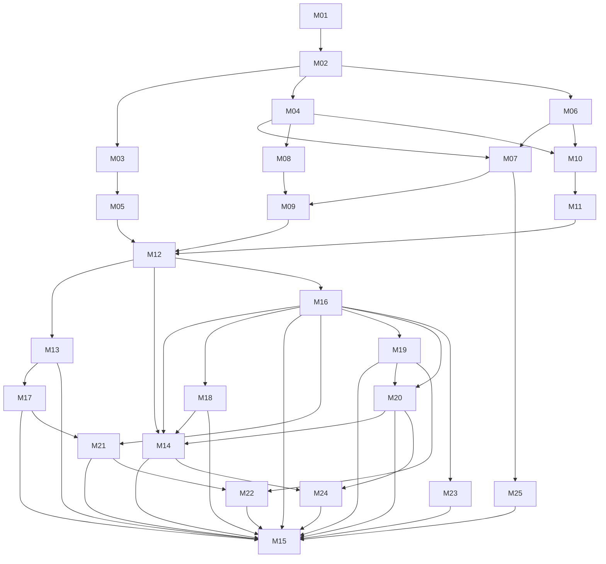

# Milestone index (MVP)

Rules: [`/AGENTS.md`](../../AGENTS.md). Pick the lowest-numbered `pending` milestone whose dependencies are all `done`.
Post-MVP items live in [`../BACKLOG.md`](../BACKLOG.md) and have no milestones yet.

Status values: `pending` · `in-progress` · `done` · `blocked: <reason>`

**Orchestration:** the `run-milestones` workflow (`.claude/workflows/run-milestones.js`) reads this table. The
**Implementer** and **Reviewer** columns set the model and reasoning effort for each milestone. **Owner gate = yes** means the run
stops after that milestone so the owner can do its checks in [`OWNER-CHECKS.md`](OWNER-CHECKS.md). Keep the column formats exactly
as shown (`<model> · <effort>`).

| ID | Milestone | MVP step | Depends on | Implementer | Reviewer | Owner gate | Status |
|---|---|---|---|---|---|---|---|
| [M01](M01-scaffold.md) | Scaffold, diagnostics, CI, Pages deploy | foundation | — | sonnet · medium | sonnet · high | yes | done |
| [M02](M02-domain-model.md) | Domain model, defaults, status rules | foundation | M01 | sonnet · medium | sonnet · high | no | done |
| [M03](M03-scoring-engine.md) | Scoring engine | generate analysis | M02 | sonnet · high | opus · high | no | done |
| [M04](M04-local-store-ingest.md) | On-device storage and photo ingest | take picture(s) | M02 | sonnet · medium | sonnet · high | no | done |
| [M05](M05-diagram-renderer.md) | Diagram renderer | generate analysis | M03 | sonnet · high | opus · high | no | done |
| [M06](M06-overlay-geometry.md) | Capture overlay geometry | take picture(s) | M02 | sonnet · medium | sonnet · high | no | done |
| [M07](M07-capture-screen.md) | Capture screen with template overlay | **1. take picture(s)** | M04, M06 | opus · high | opus · high | yes | done |
| [M08](M08-metadata-lighting.md) | Pull photo metadata and lighting | pull photo metadata | M04 | sonnet · medium | sonnet · high | no | done |
| [M09](M09-add-metadata.md) | Add metadata screen, quick start, sessions | **2. add metadata** | M07, M08 | sonnet · medium | sonnet · high | no | done |
| [M10](M10-target-alignment.md) | Pipeline runner, image review, template alignment | review image · overlay on template | M04, M06 | opus · high | opus · high | no | done |
| [M11](M11-shot-detection.md) | Shot detection | generate analysis | M10 | opus · high | opus · high | no | done |
| [M12](M12-analysis-results.md) | Analysis generation and results screen | **3. receive analysis** | M05, M09, M11 | opus · high | opus · high | no | done |
| [M13](M13-adjust-shots.md) | Adjust shots (optional correction) | optional | M12 | opus · high | opus · high | no | done |
| [M14](M14-summary-image-share.md) | Session summary image and share | **3. receive analysis** | M12, M16, M18, M20 | sonnet · medium | sonnet · high | no | done |
| [M16](M16-detection-accuracy.md) | Detection accuracy and shot constraints (rework: polarity-free, geometry masks, sheet search) | generate analysis | M12 | opus · high | opus · high | yes | done |
| [M17](M17-place-and-compare.md) | Unplaced shot markers and the diagram/photo compare slider | optional · receive analysis | M13 | opus · high | opus · high | no | done |
| [M18](M18-alignment-perspective.md) | Alignment under perspective (the centre rings) | overlay on template · generate analysis | M16 | opus · high | opus · high | yes | done |
| [M19](M19-backing-sheet.md) | Coloured backing sheet option | add metadata (option) · generate analysis | M16 | opus · high | opus · high | no | done |
| [M20](M20-declared-rounds.md) | Declared rounds are fact (reject, double punches, misses) | generate analysis | M16, M19 | opus · high | opus · high | no | done |
| [M21](M21-session-review.md) | Session review, suggested holes and double punches | optional correction · receive analysis | M16, M17 | opus · high | opus · high | yes | done |
| [M22](M22-settings-and-navigation.md) | Three main screens and a Settings screen (issue #2) | navigation · settings | M19, M21 | opus · high | opus · high | no | done |
| [M23](M23-template-guess.md) | Template guess: stop calling sighting sheets precision (issue #5) | review image · generate analysis | M16 | opus · high | opus · high | no | done |
| [M24](M24-results-clarity.md) | Results that say what they count (issues #6, #4, #8) | receive analysis | M14, M20 | sonnet · high | opus · high | no | pending |
| [M25](M25-import-review.md) | An imported photo is shown on the overlay screen (issue #1) | take picture(s) | M07 | sonnet · medium | sonnet · high | no | pending |
| [M15](M15-mvp-release.md) | Install, offline, polish, MVP release | release | M13, M14, M16, M17, M18, M19, M20, M21, M22, M23, M24, M25 | sonnet · medium | sonnet · high | yes | pending |

**M16 and M17 are numbered after M15 but run before it** (M15 depends on them). They come from the owner's review of real
targets on 2026-09-16: detection quality (REV-27, REV-28, REV-31) and placing/comparing shots by hand (REV-29, REV-30).

**M14 now waits for M16.** The session summary image packages the analysis, so there is no point building it from numbers the
owner has shown to be wrong. Run order from here: **M17 → M18 → M19 → M20 → M21 → M14 → M15** (M16 closed 2026-09-18).

**2026-09-17 owner review (REV-34 to REV-37).** The owner rated M16's first detector on 46 real photos: below 2/5, recall 53%,
precision 61%. M16 is reworked against the owner's 390 labelled holes and is now an **owner gate** — the run stops so the owner can
re-rate it with `pnpm review:detection` before anything is built on it. **M18** (new) fixes the centre-ring offset the owner reported;
it is also an owner gate, because the fix may change the stored calibration shape.

**2026-09-18 re-rating and M21 (REV-40 to REV-42).** The owner re-rated the reworked detector: **recall 76.9%, precision 94.7%,
mean quality 2.94**, which supersedes both the first review's 53% / 61% and the R4 gate's 64.1% / 81.8% (measured against
incomplete labels). Relaxing REV-27 to recover the filtered-out holes was measured and rejected — it costs 493 false detections
for 24 real ones. **M21** instead offers the ambiguous candidates to the user as suggestions, which reaches the same recall with
precision untouched; it is an owner gate because it adds a route and may need a data-model field (its open question 1).

**2026-09-19 issue sweep (REV-47 to REV-50).** The owner asked for new adjustments to be filed as GitHub issues (label
`owner-request`) and swept before the release, instead of interrupting each run. The sweep turned issues #1, #2, #4 (diagram
half), #5, #6, #7 (spec edit) and #8 (one message) into **M22–M25**; M15 now depends on them. The rest of #3, #4, #7, #8 and #9
are owner confirmations whose stated defaults stand unless overruled — and #4's scoring-rule question stays open for the owner.
Run order from here: **M22 → M23 → M24 → M25 → M15**.

**Why these tiers:**
- **Sonnet · medium**: well-specified plumbing and UI.
- **Sonnet · high with an Opus reviewer** (M03 scoring, M05 diagrams): mechanical work where every number must match the spec exactly.
- **Opus · high** (M07 camera, M10–M13 CV/pipeline/results/adjust): browser quirks, computer vision, and state handling.

**Owner gates:**
- **M01**: enable GitHub Pages and run the diagnostics on the iPhone. This validates the platform before feature work.
- **M07**: the camera and overlay checklist on the device.
- **M15**: the release sign-off.

Other milestones' device checks are recorded in `OWNER-CHECKS.md` without stopping the run.

Each milestone has: header table · Goal · Read first · In scope · Out of scope · Files · Steps · Tests · Acceptance ·
Pitfalls · Open questions · Completion notes.
