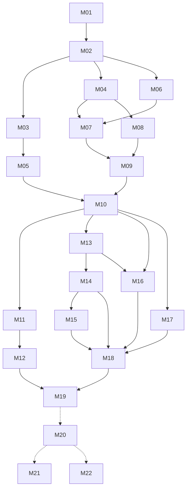

# Milestone index

Rules: [`/AGENTS.md`](../../AGENTS.md). Pick the lowest-numbered `pending` milestone whose dependencies are all `done`.
**Phase 2 (M20–M22) needs the owner's go-ahead and a re-plan pass first.**

Status values: `pending` · `in-progress` · `done` · `blocked: <reason>`

## Phase 1: on-phone web app

| ID | Milestone | Depends on | Tier | Size | Status |
|---|---|---|---|---|---|
| [M01](M01-scaffold.md) | Scaffold, diagnostics, CI, Pages deploy | — | low | M | pending |
| [M02](M02-domain-model.md) | Domain model and defaults | M01 | low | S | pending |
| [M03](M03-scoring-engine.md) | Scoring engine | M02 | low | M | pending |
| [M04](M04-local-store-ingest.md) | Local storage and ingest | M02 | low | M | pending |
| [M05](M05-diagram-renderer.md) | Diagram renderer | M03 | low | M | pending |
| [M06](M06-overlay-geometry.md) | Capture overlay geometry | M02 | low | S | pending |
| [M07](M07-capture-screen.md) | Capture screen with template overlay | M04, M06 | medium | L | pending |
| [M08](M08-metadata-lighting.md) | Photo metadata and lighting | M04 | low | M | pending |
| [M09](M09-sessions-categorize-ui.md) | Sessions, quick start, categorize UI | M07, M08 | low | M | pending |
| [M10](M10-shot-editor.md) | Shot editor, auto-review, demo session | M05, M09 | medium | L | pending |
| [M11](M11-cv-calibration.md) | CV worker and calibration refine | M10 | medium | M | pending |
| [M12](M12-cv-holes.md) | CV hole detection | M11 | medium | L | pending |
| [M13](M13-composite.md) | Composite build | M10 | low | M | pending |
| [M14](M14-share-sources.md) | Share and keep/discard sources | M13 | low | M | pending |
| [M15](M15-backup-storage.md) | Backups and storage safety | M14 | low | M | pending |
| [M16](M16-sequence-player.md) | Sequence player | M10, M13 | low | S | pending |
| [M17](M17-shooting-harness.md) | Shooting harness | M10 | low | M | pending |
| [M18](M18-offline-polish.md) | Offline PWA, polish, landing | M14, M15, M16, M17 | low | M | pending |
| [M19](M19-release.md) | Release verification (Phase 1) | M12, M18 | low | S | pending |

## Phase 2: Capacitor (outline; re-plan before starting)

| ID | Milestone | Depends on | Tier | Size | Status |
|---|---|---|---|---|---|
| [M20](M20-capacitor-shell.md) | Capacitor iOS shell | M19 | high | M | pending |
| [M21](M21-apple-health-workouts.md) | Apple Health workouts | M20 | high | L | pending |
| [M22](M22-native-photos-share.md) | Native Photos save and share | M20 | medium | S | pending |

**Parallel work after M02:** {M03 → M05}, {M04 → M08}, {M06}. After M10: {M11 → M12}, {M13 → M14 → M15}, {M16}, {M17}.

Each milestone has: header table · Goal · Read first · In scope · Out of scope · Files · Steps · Tests · Acceptance ·
Pitfalls · Open questions · Completion notes.
