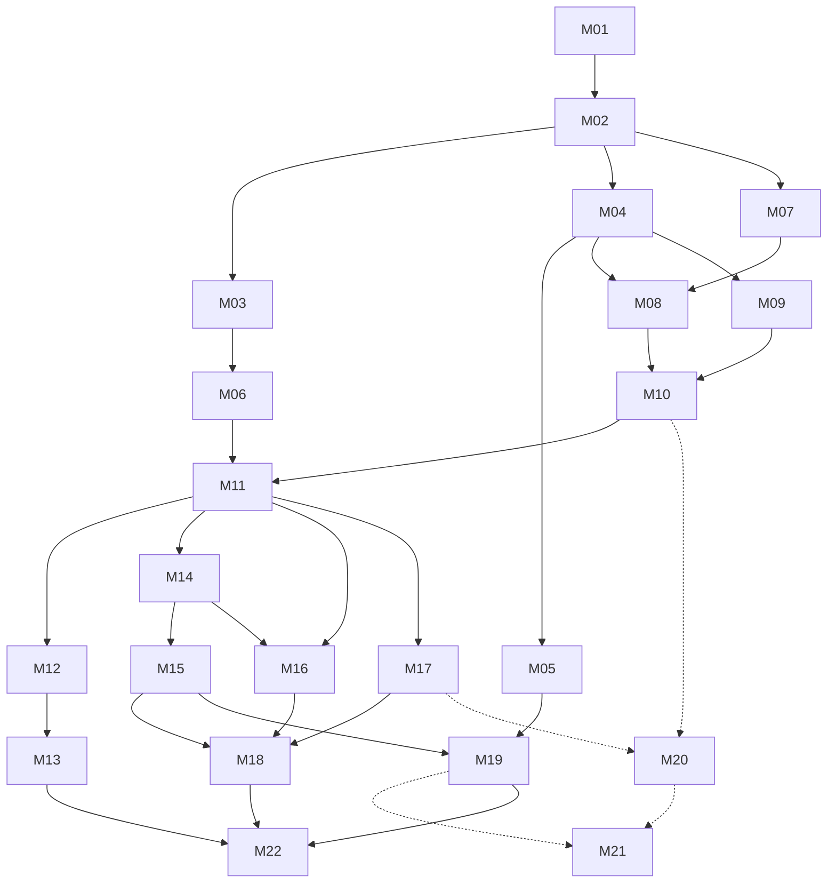

# Milestone index

Rules: [`/AGENTS.md`](../../AGENTS.md). Pick the lowest-numbered `pending` milestone whose dependencies are all
`done`. **M20–M21 are optional** (Garmin track); skip them unless the owner asks.

Status values: `pending` · `in-progress` · `done` · `blocked: <reason>`

| ID | Milestone | Depends on | Tier | Size | Track | Status |
|---|---|---|---|---|---|---|
| [M01](M01-scaffold.md) | Scaffold and tooling | — | low | M | core | pending |
| [M02](M02-domain-model.md) | Domain model and defaults | M01 | low | S | core | pending |
| [M03](M03-scoring-engine.md) | Scoring engine | M02 | low | M | core | pending |
| [M04](M04-workspace-ingest.md) | Workspace storage and ingest API | M02 | low | M | core | pending |
| [M05](M05-single-user-access.md) | Single-user access | M04 | low | M | core | pending |
| [M06](M06-diagram-renderer.md) | Diagram renderer | M03 | low | M | core | pending |
| [M07](M07-overlay-geometry.md) | Capture overlay geometry | M02 | low | S | core | pending |
| [M08](M08-capture-screen.md) | Capture screen with template overlay | M04, M07 | medium | L | core | pending |
| [M09](M09-metadata-lighting.md) | Photo metadata and lighting | M04 | low | M | core | pending |
| [M10](M10-sessions-categorize-ui.md) | Sessions and categorize UI | M08, M09 | low | M | core | pending |
| [M11](M11-shot-editor.md) | Shot editor and demo seed | M06, M10 | medium | L | core | pending |
| [M12](M12-cv-calibration.md) | CV calibration refine | M11 | medium | M | core | pending |
| [M13](M13-cv-holes.md) | CV hole detection | M12 | medium | L | core | pending |
| [M14](M14-composite.md) | Composite build | M11 | low | M | core | pending |
| [M15](M15-share-sources.md) | Share and keep/discard sources | M14 | low | M | core | pending |
| [M16](M16-sequence-player.md) | Sequence player | M11, M14 | low | S | core | pending |
| [M17](M17-shooting-harness.md) | Shooting harness | M11 | low | M | core | pending |
| [M18](M18-polish-pwa.md) | Visual polish, PWA, landing | M15, M16, M17 | low | M | core | pending |
| [M19](M19-deployment.md) | Deployment (Docker + Tailscale) | M05, M15 | medium | M | core | pending |
| [M20](M20-garmin-demo-tagging.md) | Garmin: demo provider, tagging, suggestions, load | M10, M17 | low | M | optional | pending |
| [M21](M21-garmin-live.md) | Garmin: live own-account connection | M19, M20 | high | L | optional | pending |
| [M22](M22-release.md) | Release verification | M13, M18, M19 | low | S | core | pending |

**Parallel work after M02:** {M03 → M06}, {M04 → M05, M09}, {M07}. After M11: {M12 → M13}, {M14 → M15},
{M16}, {M17}.

## Milestone file template

Each milestone has: header table · Goal · Read first · In scope · Out of scope · Files · Steps · Tests ·
Acceptance · Pitfalls · Open questions · Completion notes.
