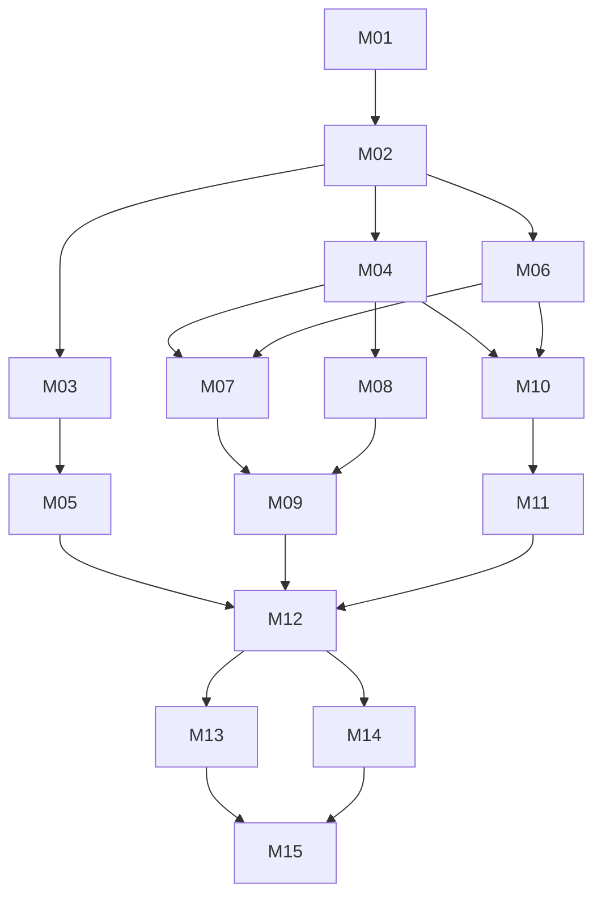

# Milestone index (MVP)

Rules: [`/AGENTS.md`](../../AGENTS.md). Pick the lowest-numbered `pending` milestone whose dependencies are all `done`.
Post-MVP items live in [`../BACKLOG.md`](../BACKLOG.md) and have no milestones yet.

Status values: `pending` · `in-progress` · `done` · `blocked: <reason>`

| ID | Milestone | MVP step | Depends on | Tier | Size | Status |
|---|---|---|---|---|---|---|
| [M01](M01-scaffold.md) | Scaffold, diagnostics, CI, Pages deploy | foundation | — | low | M | pending |
| [M02](M02-domain-model.md) | Domain model, defaults, status rules | foundation | M01 | low | S | pending |
| [M03](M03-scoring-engine.md) | Scoring engine | generate analysis | M02 | low | M | pending |
| [M04](M04-local-store-ingest.md) | On-device storage and photo ingest | take picture(s) | M02 | low | M | pending |
| [M05](M05-diagram-renderer.md) | Diagram renderer | generate analysis | M03 | low | M | pending |
| [M06](M06-overlay-geometry.md) | Capture overlay geometry | take picture(s) | M02 | low | S | pending |
| [M07](M07-capture-screen.md) | Capture screen with template overlay | **1. take picture(s)** | M04, M06 | medium | L | pending |
| [M08](M08-metadata-lighting.md) | Pull photo metadata and lighting | pull photo metadata | M04 | low | M | pending |
| [M09](M09-add-metadata.md) | Add metadata screen, quick start, sessions | **2. add metadata** | M07, M08 | low | M | pending |
| [M10](M10-target-alignment.md) | Pipeline runner, image review, template alignment | review image · overlay on template | M04, M06 | medium | M | pending |
| [M11](M11-shot-detection.md) | Shot detection | generate analysis | M10 | medium | L | pending |
| [M12](M12-analysis-results.md) | Analysis generation and results screen | **3. receive analysis** | M05, M09, M11 | medium | L | pending |
| [M13](M13-adjust-shots.md) | Adjust shots (optional correction) | optional | M12 | medium | M | pending |
| [M14](M14-summary-image-share.md) | Session summary image and share | **3. receive analysis** | M12 | low | M | pending |
| [M15](M15-mvp-release.md) | Install, offline, polish, MVP release | release | M13, M14 | low | M | pending |

**Parallel work after M02:** {M03 → M05}, {M04 → M08}, {M06}. After M04 + M06: {M07 → M09} and {M10 → M11} in parallel.
After M12: {M13}, {M14}.

Each milestone has: header table · Goal · Read first · In scope · Out of scope · Files · Steps · Tests · Acceptance ·
Pitfalls · Open questions · Completion notes.
