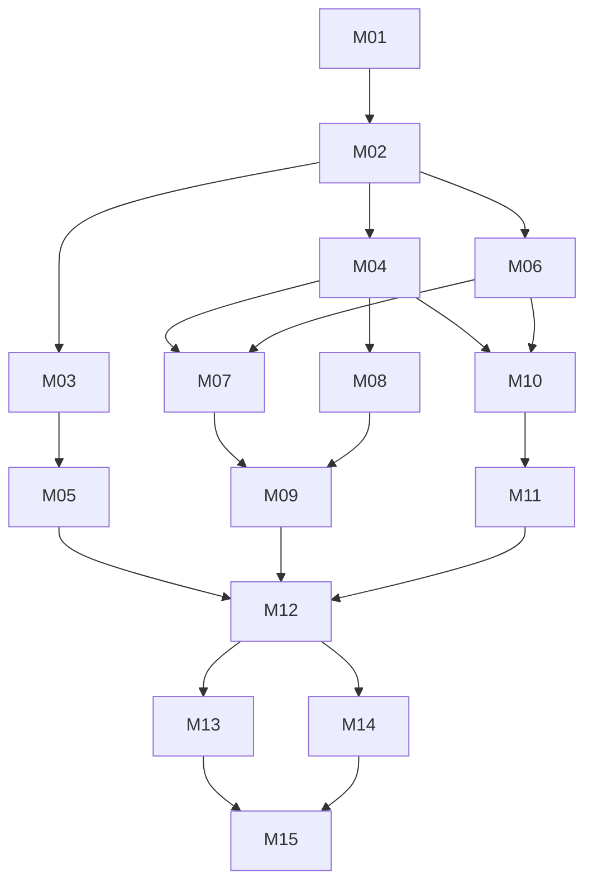

# Milestone index (MVP)

Rules: [`/AGENTS.md`](../../AGENTS.md). Pick the lowest-numbered `pending` milestone whose dependencies are all `done`.
Post-MVP items live in [`../BACKLOG.md`](../BACKLOG.md) and have no milestones yet.

Status values: `pending` · `in-progress` · `done` · `blocked: <reason>`

**Orchestration:** the `run-milestones` workflow (`.claude/workflows/run-milestones.js`) reads this table. The
**Implementer** and **Reviewer** columns set the model and reasoning effort for each milestone. **Owner gate = yes** means the run
stops after that milestone so the owner can do its checks in [`OWNER-CHECKS.md`](OWNER-CHECKS.md). Keep the column formats exactly
as shown (`<model> · <effort>`).

| ID | Milestone | MVP step | Depends on | Implementer | Reviewer | Owner gate | Status |
|---|---|---|---|---|---|---|---|
| [M01](M01-scaffold.md) | Scaffold, diagnostics, CI, Pages deploy | foundation | — | sonnet · medium | sonnet · high | yes | done |
| [M02](M02-domain-model.md) | Domain model, defaults, status rules | foundation | M01 | sonnet · medium | sonnet · high | no | done |
| [M03](M03-scoring-engine.md) | Scoring engine | generate analysis | M02 | sonnet · high | opus · high | no | done |
| [M04](M04-local-store-ingest.md) | On-device storage and photo ingest | take picture(s) | M02 | sonnet · medium | sonnet · high | no | done |
| [M05](M05-diagram-renderer.md) | Diagram renderer | generate analysis | M03 | sonnet · high | opus · high | no | done |
| [M06](M06-overlay-geometry.md) | Capture overlay geometry | take picture(s) | M02 | sonnet · medium | sonnet · high | no | done |
| [M07](M07-capture-screen.md) | Capture screen with template overlay | **1. take picture(s)** | M04, M06 | opus · high | opus · high | yes | done |
| [M08](M08-metadata-lighting.md) | Pull photo metadata and lighting | pull photo metadata | M04 | sonnet · medium | sonnet · high | no | done |
| [M09](M09-add-metadata.md) | Add metadata screen, quick start, sessions | **2. add metadata** | M07, M08 | sonnet · medium | sonnet · high | no | done |
| [M10](M10-target-alignment.md) | Pipeline runner, image review, template alignment | review image · overlay on template | M04, M06 | opus · high | opus · high | no | done |
| [M11](M11-shot-detection.md) | Shot detection | generate analysis | M10 | opus · high | opus · high | no | pending |
| [M12](M12-analysis-results.md) | Analysis generation and results screen | **3. receive analysis** | M05, M09, M11 | opus · high | opus · high | no | pending |
| [M13](M13-adjust-shots.md) | Adjust shots (optional correction) | optional | M12 | opus · high | opus · high | no | pending |
| [M14](M14-summary-image-share.md) | Session summary image and share | **3. receive analysis** | M12 | sonnet · medium | sonnet · high | no | pending |
| [M15](M15-mvp-release.md) | Install, offline, polish, MVP release | release | M13, M14 | sonnet · medium | sonnet · high | yes | pending |

**Why these tiers:**
- **Sonnet · medium**: well-specified plumbing and UI.
- **Sonnet · high with an Opus reviewer** (M03 scoring, M05 diagrams): mechanical work where every number must match the spec exactly.
- **Opus · high** (M07 camera, M10–M13 CV/pipeline/results/adjust): browser quirks, computer vision, and state handling.

**Owner gates:**
- **M01**: enable GitHub Pages and run the diagnostics on the iPhone. This validates the platform before feature work.
- **M07**: the camera and overlay checklist on the device.
- **M15**: the release sign-off.

Other milestones' device checks are recorded in `OWNER-CHECKS.md` without stopping the run.

Each milestone has: header table · Goal · Read first · In scope · Out of scope · Files · Steps · Tests · Acceptance ·
Pitfalls · Open questions · Completion notes.
